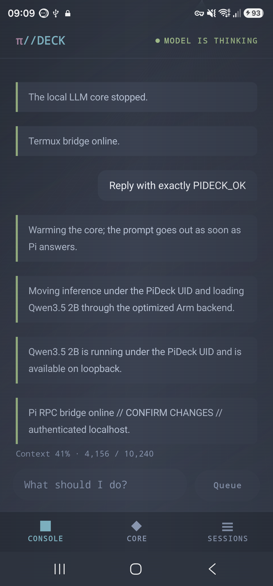
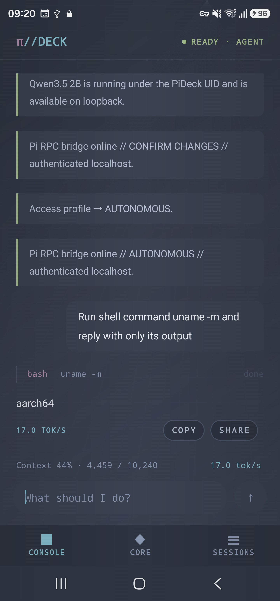
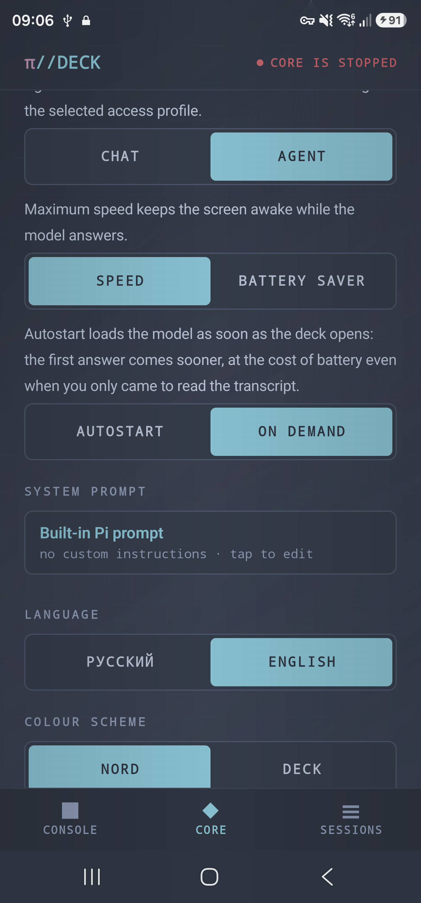

<div align="center">

# π//DECK

**A local Android coding agent powered by Termux**

[English](README.md) · [Русский](README.ru.md)

[](https://github.com/tigrohvost/pi-deck/actions/workflows/build.yml)
[](LICENSE)

</div>

[Pi](https://github.com/earendil-works/pi) lives entirely on the phone. Model
inference runs in the Android app's foreground service; shell commands, files,
Python, and sessions live in Termux. The two sides communicate through an
authenticated loopback RPC bridge, with no root required.

> [!WARNING]
> Local inference is not an OS sandbox. Depending on the selected access
> profile, tools run with the Termux user's permissions and may access the
> network. Explicit web tools send their own requests even though model
> inference stays on-device.

## Current validated build

`0.3.0-alpha13` (`versionCode 21`, runtime contract 53) is the current source
and handset-tested state. On the reference Samsung SM-S918B, the selected
LFM2.5 2.6B QAD Q4_0 profile is `READY · AGENT`, uses a 10,240-token context
and a native 256-token reasoning cap, and is shown as both `recommended` and
`active`. Its exact installed APK and model hashes match the local artifacts.
During an active task the metrics row stays on one line: context condenses to
`CTX ≈10% · 986/10240`, while accessibility keeps the full localized value.
This layout is device-tested at 360 dp with the largest in-app text scale in
both interface languages.

The alpha13 gate passed Gradle unit/lint/debug/androidTest/unsigned-release
builds, 117 runtime tests, 43 tooling tests, the 11-extension/9-tool contract,
the pinned Pi RPC smoke, and the 28-task benchmark-contract validator. Debug
APKs are Android-debug-signed and intended only for sideloading; an unsigned
release artifact is never presented as a production release.

## What it looks like

| A cold prompt warms and dispatches itself | The agent runs a command |
|:--:|:--:|
|  |  |
| **Core, model, mode, and autostart** | **The alternative DECK palette** |
|  |  |

## Architecture at a glance

- inference runs under the PI//DECK UID in a foreground service, so an open
  deck receives Android's `top-app` CPU set instead of Termux background cores;
- Pi 0.82.1, shell, Python, workspace, and sessions run inside Termux;
- app ↔ Termux traffic uses authenticated HTTP on `127.0.0.1` with a random
  256-bit token;
- GGUF files are SHA-256 verified, copied into app-private storage, and made
  read-only;
- stock models use pinned `llama.cpp b10092`; Nanbeige uses a separately pinned
  Android sidecar and cannot replace the stock server for other models.
- Pi function tools use ordinary OpenAI-compatible schemas, not strict sampler
  grammars: this avoids the b10092 grammar-parser failure while preserving the
  bridge's tool validation and permission gates;
- the capacity-gated automatic ladder is LFM2.5 2.6B QAD Q4_0 → Qwen3.5 2B →
  0.8B. QAD uses native reasoning capped at 256 tokens, while Pi receives only
  the currently active model contract;
- manually selected Qwen3.5 4B keeps adaptive FAST/DEEP behavior with a
  512-token reasoning cap. A tool turn keeps a stable schema for prompt-cache
  reuse;
- a short direct live-data question exposes exactly one bounded web or weather
  tool and caps both provider rounds at 256 tokens; multi-step research stays
  on the ordinary agent route;
- scoped repairs prefetch complete small files explicitly named by the user
  before the first model request, so verified `line:hash` edits need no initial
  `read` round trip.

## Requirements

- Android 8.0 / API 26 or newer, arm64;
- [Termux 0.118.0+ from F-Droid](https://f-droid.org/packages/com.termux/);
- enough storage for both the downloaded GGUF and its private verified copy;
- Node.js 22.19.0 or newer inside Termux. `INSTALL CORE` installs or updates the
  required packages.

## Quick start

1. Install Termux and grant PI//DECK the `RUN_COMMAND` permission.
2. Tap `COPY + OPEN`, paste the generated command into Termux, and run it. The
   equivalent command is:

   ```sh
   mkdir -p ~/.termux && \
     (grep -q '^allow-external-apps=true$' ~/.termux/termux.properties 2>/dev/null || \
     printf '\nallow-external-apps=true\n' >> ~/.termux/termux.properties) && \
     termux-reload-settings && \
     ([ -d "$HOME/storage/downloads" ] || termux-setup-storage)
   ```

3. Tap `INSTALL CORE`. It deploys the pinned Pi package, Python runtime, and
   tools without overwriting `~/.pideck/workspace/AGENTS.md`. If the configured
   Termux mirror reports an index-size/hash synchronization error, the installer
   retries through the signed official `packages.termux.dev` repository for
   that operation only; it does not rewrite the user's repository selection.
4. Choose a model in `Core`, tap `DOWNLOAD`, then `VERIFY`. The shared incoming
   file is retained separately after the verified private copy is installed.
5. Send a prompt. A cold deck queues it, warms the model, and dispatches it when
   the Pi RPC bridge is ready. `Core → Autostart` can warm the model earlier.

Runtime layout:

```text
~/.pideck/workspace/     agent workspace and AGENTS.md
~/.pideck/sessions/      durable Pi sessions
~/.pideck/runtime/       versioned Python/Pi runtime
~/.pideck/logs/          component diagnostics
Android app data/        private read-only GGUF and native server log
```

## Access profiles

| Profile | Behavior |
|---|---|
| `AUTONOMOUS` | Default; shell and file changes run as the Termux user without per-command approval |
| `CONFIRM_CHANGES` | `bash`, edit, and write require a one-time Android approval with a TTL |
| `READ_ONLY` | Read/search plus bounded managed `web_search` and `weather` tools |

The profile is selected under `Core → Access`. The workspace is a useful
boundary, not an OS sandbox. Closing the UI, a timeout, bridge disconnect, or
restart denies any pending approval.

> [!WARNING]
> A deck upgraded from alpha7 that never changed its access profile manually
> migrates to `AUTONOMOUS`. This is an intentional privilege change and is shown
> by the consent flow.

## Core settings

- **Mode** — Agent for tools and files, or Chat for a direct response;
- **Autostart** — load the selected model when the deck opens; off by default;
- **Core timeout** — the idle model unloads itself after 5/10/30 minutes, or never;
- **Cooldown wait** — optionally wait up to 60 s for the clock to recover before dispatching;
- **System prompt** — append to the built-in Pi prompt or replace it entirely;
- **Language** — Russian or English UI without rewriting user/agent messages;
- **Maximum speed** — keep the screen awake while inference is active.

## Models

Models remain `EXPERIMENTAL` or manual-only `CANDIDATE` until their provenance
and full real-device admission suite are complete. Unknown model IDs are never
silently replaced by a recommendation.

The automatic model ladder now prefers the official
[LFM2.5 2.6B QAD Q4_0](https://huggingface.co/LiquidAI/LFM2.5-2.6B-GGUF)
when current free RAM and storage pass the guard, then falls back to Qwen3.5 2B
and 0.8B. On SM-S918B with the shipped b10092 runtime, QAD measured 16.47 tok/s
at 128 tokens and 15.71 tok/s at 192 tokens, versus 12.32 tok/s for Q4_K_M. A
saved manual selection is never migrated; Qwen3.5 4B and larger profiles remain
explicit choices. The full 28-task admission suite is still pending.

| Model | Status | Runtime and current evidence |
|---|---|---|
| Qwen3.5 0.8B / 2B / 4B / 9B | `EXPERIMENTAL` | Stock b10092; immutable artifacts. Qwen 2B has app-private SHA, server, and Pi smoke evidence |
| LFM2.5 2.6B Q4_K_M | `CANDIDATE` | Stock b10092; manual selection after the exact 192-token run measured 12.32 tok/s |
| LFM2.5 2.6B QAD Q4_0 | `EXPERIMENTAL` | Official immutable QAD artifact on stock b10092; 16.47/15.71 tok/s at 128/192 tokens plus a valid `read` → correct `edit` → final-answer loop with a 256-token reasoning cap; full suite pending |
| Ministral 3 3B Instruct | `CANDIDATE` | Official GGUF on stock b10092. Download, SHA/private install, startup, and tool-schema Pi turns passed on SM-S918B; full suite and Russian behavior remain unverified |
| Nanbeige4.2 3B | `CANDIDATE` | Pinned Q4_K_M plus isolated `nanbeige42-c6640a1` sidecar. Download and SHA/private install passed on SM-S918B; inference suite is still pending |
| Bonsai 27B | `CANDIDATE` | Manual-only 1-bit experiment: about 1.16 tok/s despite fitting in less memory than Qwen 4B |

The first Ministral handset smoke measured about 23.2 prompt tokens/s and 0.5
decode tokens/s for a six-token reply. It is proof of compatibility, not a
recommendation. Its strict embedded template also rejects a legacy session
that ends with an unmatched user turn; starting a new session preserves the old
history and restores valid role alternation.

New models must pass [`tools/pin_model.py`](tools/pin_model.py), license review,
immutable revision/size/SHA checks, and the 28-task device benchmark. Repository
popularity is not an admission signal.

## Build and test

Native arm64 binaries are rebuilt from pinned sources rather than stored in
Git. Stock b10092 requires NDK 27.1; the Nanbeige sidecar requires NDK 28.2 and
Android CMake 3.22.1:

```sh
ANDROID_NDK_ROOT="$ANDROID_HOME/ndk/27.1.12297006" \
  PIDECK_NANBEIGE_NDK_ROOT="$ANDROID_HOME/ndk/28.2.13676358" \
  ./tools/vendor_llama_android.sh
```

```sh
./gradlew -Dorg.gradle.java.home=/usr/lib/jvm/java-21-openjdk-amd64 \
  testDebugUnitTest lintDebug assembleDebug assembleRelease
PYTHONDONTWRITEBYTECODE=1 python3 -W error::ResourceWarning \
  -m unittest discover -s tests/runtime -v
python3 -m unittest discover -s tests/tools -v
python3 tools/validate_benchmark.py
```

JDK 21 is required. Without production signing secrets the release APK remains
unsigned; the build never substitutes the Android debug key for a release.
Published releases additionally require a verified tag, checksums, and a
CycloneDX SBOM containing both native runtimes.

## Documentation

- [Русский README](README.ru.md)
- [Changelog](CHANGELOG.md)
- [Architecture](docs/architecture.md)
- [Security model](docs/security-model.md)
- [RPC bridge](docs/rpc-bridge.md)
- [Model admission](docs/model-admission.md)
- [Compatibility matrix](docs/compatibility-matrix.md)
- [ADB performance evidence](docs/performance.md)
- [Release process](docs/release-process.md)
- [Architecture decisions](docs/adr/README.md)

## License

[MIT](LICENSE)
