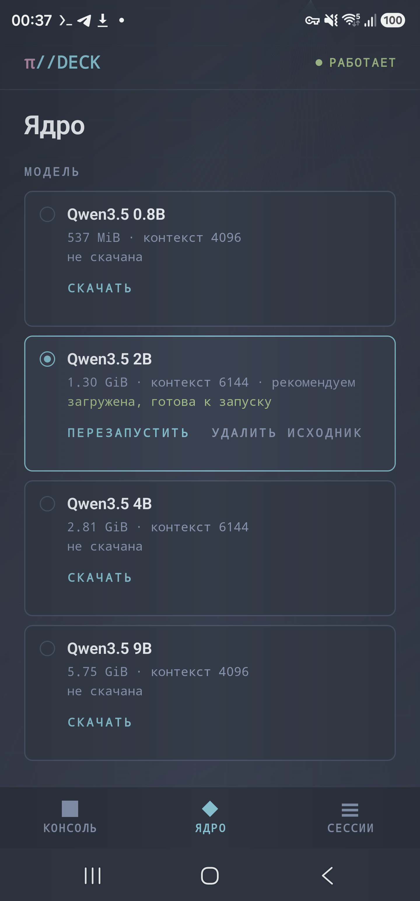
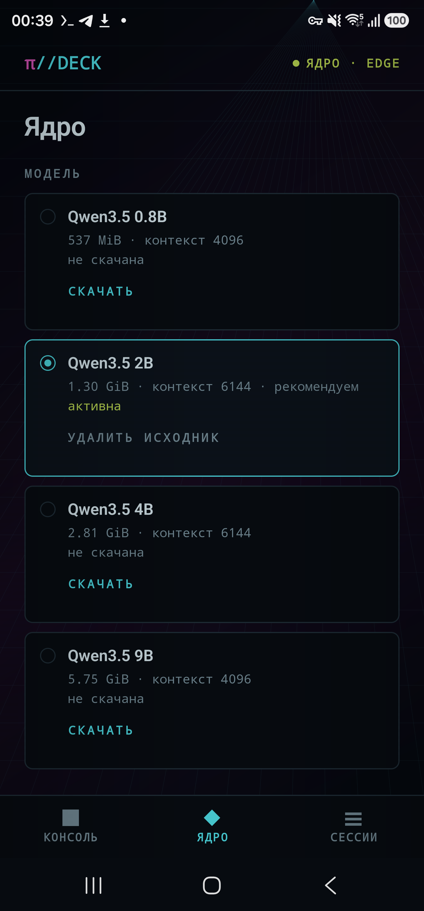

<div align="center">

# π//DECK

**Локальный coding agent для Android через Termux**
**A local Android coding agent powered by Termux**

[](https://github.com/tigrohvost/pi-deck/actions/workflows/build.yml)
[](LICENSE)

</div>

PI//DECK is a native Android Views console for a pinned
[Pi](https://github.com/earendil-works/pi) coding agent. Inference runs on the
phone through an app-owned foreground `llama-server`; the agent and shell
runtime live in Termux without root.

> Local inference is not network isolation. Depending on the selected access
> profile, tools running as the Termux user may access files and the network.

## Интерфейс · Interface

| Nord — локальное ядро | DECK — локальное ядро |
|:--:|:--:|
|  |  |

## Русский

### Что изменено в 0.3.0-alpha7

- в `ЯДРО → Язык` можно переключить весь интерфейс между русским и английским;
  выбор сохраняется, а тексты пользователя и агента не переводятся и не
  переписываются;
- рядом с каждым завершённым ответом сохраняется его реальная скорость
  генерации: число выходных токенов из provider usage делится на измеренное
  decode-время именно этого ответа;
- на Samsung SM-S918B проверен полный агентный цикл: Pi создал Python-скрипт и
  тест, запросил одноразовые разрешения, сам выполнил
  `python …/test_hello_math.py` и вернул `Result: 8`;
- сгенерированный provider-конфиг теперь явно запрашивает streaming usage у
  llama.cpp; контракт Termux-рантайма поднят до 12, поэтому старый конфиг не
  может незаметно оставить в UI приблизительную скорость.

### Что проверено для alpha7

| Контур | Результат |
|---|---|
| Android/JVM | unit tests, lint, debug, androidTest APK и release APK собраны на JDK 21 |
| Termux runtime | 54 host-теста прошли |
| Управляемые инструменты | 5 host-тестов прошли |
| Pi RPC | реальный локальный Pi 0.82.1 прошёл protocol smoke |
| Samsung SM-S918B / API 36 | язык EN пережил обновление APK; runtime contract 12 принят; агент записал и выполнил Python; terminal usage дал 1840 output tokens и 13.7 ток/с без `≈` |

> [!NOTE]
> Этот smoke подтверждает доступ агента к записи и Python через approval gate,
> но не гарантирует надёжность длинных цепочек на Qwen3.5 2B. В более строгом
> повторе модель ушла в диагностический цикл; разрешения с TTL при этом, как и
> задумано, закрылись по истечении времени.

### Что изменено в 0.3.0-alpha6

- управляемые `web_search` и `weather` доступны и в стартовом профиле
  `READ ONLY`, не открывая shell или запись файлов;
- явный запрос актуальных данных принимается только после успешного сетевого
  инструмента: при попытке ответить из памяти или искать в workspace bridge
  один раз направляет модель к нужному инструменту;
- служебный повтор больше не подписан неоднозначным «восстановлением» или
  «повтором ответа»: интерфейс показывает «Задача продолжается» либо
  «Получаю актуальные данные».

### Что изменено в 0.3.0-alpha5

- в режимах `CONFIRM CHANGES` и `AUTONOMOUS` появились управляемые инструменты
  `web_search` и `weather`; они загружаются из APK явно, даже если пользовательские
  расширения Pi отключены;
- запросы о погоде получают компактные актуальные данные Open-Meteo, а общий
  веб-поиск возвращает ограниченный набор результатов с URL источников;
- ответ, состоящий только из знаков Markdown вроде `**`, больше не считается
  успешным: bridge очищает его, один раз просит модель ответить заново и после
  повторного сбоя показывает честную ошибку.

### Что изменено в 0.3.0-alpha4

- во время печати рядом с контекстом видна сглаженная оценка `≈… ток/с`;
  после завершения Pi заменяет её итоговой скоростью по точному числу выходных
  токенов provider usage;
- показатель остаётся на экране до следующего запроса и озвучивается
  accessibility-службами как примерный или итоговый.

### Что изменено в 0.3.0-alpha3

- режим `Чат` запускает Pi без инструментов и уменьшает служебный контекст для
  быстрых разговорных ответов; `Агент` сохраняет работу с файлами и shell;
- заполнение текущего окна теперь видно в консоли, а перед медленным запросом
  можно сжать историю или начать чистую сессию без потери набранного текста;
- desktop-пороги автосжатия Pi заменены на безопасные значения для локальных
  окон 4k–10k; большие результаты инструментов сокращаются до 12 KiB, а полная
  версия остаётся в приватном `~/.pideck/tool-results`;
- интерфейс показывает этапы подготовки/генерации/инструментов и примерную
  скорость, принимает один следующий запрос в очередь и очищает редактор только
  после подтверждения RPC;
- потоковый ответ добавляется кадрами без полного `setText`, а автопрокрутка не
  возвращает пользователя вниз, если он читает предыдущий текст;
- foreground inference удерживает CPU во время активного turn, экран можно
  оставить включённым в профиле `Скорость`;
- IME-insets и `adjustResize` удерживают поле ввода над клавиатурой Android 15;
- системный промпт редактируется в `ЯДРО` в режимах дополнения или полной замены.

### Что изменено в 0.3.0-alpha2

- официальный Android arm64 runtime `llama.cpp b10092` встроен в APK и
  проверяется по размеру и SHA-256 во время каждой сборки;
- `llama-server` работает под UID PI//DECK в foreground-service, поэтому
  открытая дека получает Android `top-app` CPU-set вместо фоновых ядер Termux;
- профиль телефона выбирается автоматически: на Snapdragon 8 Gen 2 decode
  использует 5 быстрых ядер, prompt batch — все 8;
- MTP/speculative decoding намеренно запрещён: на реальном Qwen3.5 2B он был
  медленнее обычного decode;
- GGUF после Android incoming-проверки повторно хешируется и атомарно
  устанавливается с режимом `0400` в приватное хранилище самого приложения;
- Termux больше не устанавливает вторую копию `llama-cpp`; он отвечает за
  Pi 0.82.1, shell, сессии и authenticated RPC;
- новый контракт `server-adopt` принимает app-owned сервер только после
  точного model/API-key health-check; быстрый restart RPC исправлен для TCP
  `TIME_WAIT`;
- на Samsung SM-S918B direct ADB smoke дал 16.13 токена/с внутри сервера и
  15.54 токена/с end-to-end wall при 292 output tokens;
- упавший инструмент больше не роняет весь turn: агент читает ошибку и берёт
  следующий вызов, а `TURN_FAILED` остаётся только за ошибкой модели и
  падением child-процесса.

### Требования

- Android 8.0 / API 26 или новее, 64-битный ABI;
- Termux `0.118.0+` из
  [F-Droid](https://f-droid.org/packages/com.termux/);
- Node.js `22.19.0+` внутри Termux;
- свободное место для incoming GGUF, приватной копии, временного файла и
  safety margin.

Приложение проверяет package name, версию и signing certificate Termux. GitHub
build с публичным shared test key распознаётся отдельно и показывает
предупреждение; неизвестная подпись блокируется.

### Первый запуск

1. Установите Termux и выдайте PI//DECK разрешение `RUN_COMMAND`.
2. Выполните один раз скопированную приложением команду:

   ```sh
   mkdir -p ~/.termux && \
     (grep -q '^allow-external-apps=true$' ~/.termux/termux.properties 2>/dev/null || \
     printf '\nallow-external-apps=true\n' >> ~/.termux/termux.properties) && \
     termux-reload-settings && \
     ([ -d "$HOME/storage/downloads" ] || termux-setup-storage)
   ```

3. Нажмите `INSTALL CORE`. Installer создаёт versioned runtime и не
   перезаписывает пользовательский `~/.pideck/workspace/AGENTS.md`.
4. Выберите модель, скачайте её, дождитесь Android SHA-256 и нажмите
   `INSTALL PRIVATE`. Копия будет сохранена в sandbox PI//DECK.
5. Запустите server и authenticated Pi RPC bridge.

Пути:

```text
~/.pideck/runtime/       versioned Python/Pi runtime
~/.pideck/workspace/     agent workspace and AGENTS.md
~/.pideck/sessions/      Pi sessions
~/.pideck/logs/          private component diagnostics
Android app data/        private read-only GGUF and native server log
```

### Профили доступа

| Профиль | Поведение |
|---|---|
| `READ_ONLY` | default; локальные `read`, `grep`, `find`, `ls` плюс ограниченные `web_search` и `weather`; shell и запись недоступны |
| `CONFIRM_CHANGES` | mutating built-ins отключены; bash/edit/write требуют одноразового Android approval с TTL |
| `AUTONOMOUS` | явный high-risk opt-in; полный shell в пределах прав Termux UID |

Workspace — удобная рабочая директория, но не системная песочница. Закрытие UI,
timeout, disconnect, duplicate approval или restart bridge означают deny.

### Системный промпт

В `ЯДРО → Системный промпт` можно добавить собственные инструкции агенту или
полностью заменить встроенный промпт Pi. Режим `Дополнить` рекомендуется:
он сохраняет стандартное описание инструментов и поведения Pi. Пустое поле
возвращает встроенный промпт. После сохранения приложение перезапускает только
RPC bridge; модель остаётся загруженной.

### Модели

Текущие Qwen3.5 0.8B/2B/4B/9B сохранены для совместимости, но остаются
`EXPERIMENTAL`: их bytes/SHA закреплены, а полный conversion provenance и
актуальный device benchmark ещё не завершены. Приложение не подменяет
неизвестный model ID рекомендацией.

Новые модели добавляются только через
[`tools/pin_model.py`](tools/pin_model.py), проверку лицензии/provenance и
28-задачный device benchmark. Название репозитория или публичный leaderboard не
являются admission gate.

### Сборка и тесты

Нативные arm64-библиотеки не хранятся в репозитории. Перед первой сборкой
восстановите их из закреплённого `llama.cpp b10092` — скрипт проверяет SHA-256
архива и снимает символы через `llvm-strip` из NDK:

```sh
ANDROID_NDK_ROOT="$ANDROID_HOME/ndk/27.1.12297006" \
  ./tools/vendor_llama_android.sh
```

```sh
./gradlew -Dorg.gradle.java.home=/usr/lib/jvm/java-21-openjdk-amd64 \
  testDebugUnitTest lintDebug assembleDebug assembleRelease
PYTHONDONTWRITEBYTECODE=1 python3 -m unittest discover -s tests/runtime -v
python3 tools/validate_benchmark.py
```

Gradle 8.10.2 обязателен на JDK 21: на JDK 25 Kotlin DSL падает при разборе
версии JVM, поэтому `-Dorg.gradle.java.home` выше не опционален.

Без production keystore release APK намеренно остаётся unsigned. Debug key
никогда не подставляется в release. Процесс подписанного релиза описан в
[`docs/release-process.md`](docs/release-process.md).

Проверенная ADB-методика, cold start, CPU-set и память:
[`docs/performance.md`](docs/performance.md).

## English

PI//DECK 0.3.0-alpha7 adds a persistent Russian/English interface switch and
keeps exact provider-usage-backed decode speed beside every completed answer,
including after Activity recreation. The generated Pi provider configuration
now explicitly requests streaming usage from llama.cpp, and runtime contract 12
prevents an older Termux configuration from silently falling back to an
estimated rate.

On a Samsung SM-S918B / API 36, the English locale survived an APK update; Pi
0.82.1 authored a Python script and test, executed
`python …/test_hello_math.py` through the approval gate, and returned
`Result: 8`. A provider terminal event reported 1,840 output tokens at
13.7 tok/s without the approximate `≈` marker. Host validation passed 54
runtime tests, five managed-tool tests, and the real local Pi RPC protocol
smoke; the JDK 21 Android unit/lint/debug/androidTest/release build also passed.

This bounded smoke proves that the tool path works, not that a 2B model is
reliable on every long workflow. A stricter follow-up entered a diagnostic
loop; its short-lived approvals expired fail-closed as designed.

Alpha7 builds on alpha6, which makes the managed `web_search` and `weather` tools
available in the default read-only Agent profile and requires an applicable
successful tool call for explicit live-data prompts. It also replaces
ambiguous retry status copy. It builds on alpha5's bounded retry for
Markdown-only model output and alpha4's
live estimated decode-rate indicator and replaces
it with provider-usage-backed output tokens per second when a turn settles.
It builds on alpha3's phone-sized context compaction, tool-free Chat mode,
bounded tool results, phase-aware streaming UI, prompt queueing and foreground
turn wake locks, plus the alpha2 migration that moved
`llama.cpp b10092` and the verified private GGUF
into the Android app sandbox. An app-owned foreground service now runs
inference while Termux remains responsible for Pi 0.82.1, sessions, tools and
the authenticated JSONL RPC bridge. The APK carries pinned arm64 CPU variants,
selects a heterogeneous-core profile and does not enable slower speculative
MTP.

The native UI now ships with switchable `NORD` and `DECK` palettes, dedicated
Console, Core and Sessions tabs, live core state, and consistent action,
decision and failure cards. The runtime contract is versioned so an older
Termux bundle cannot be mistaken for one that supports the new screens.

A tool that fails is an event the model reacts to, not the end of the turn, so
a failing call is reported on its own card while the turn keeps running.
`TURN_FAILED` is reserved for a model error or a dead child process.

The default `READ_ONLY` profile has no mutating tools: it exposes local
read/search tools plus bounded `web_search` and `weather`. `CONFIRM_CHANGES`
disables the built-in mutators and exposes one-time approval-gated equivalents.
`AUTONOMOUS` is an explicit high-risk opt-in with all permissions available to
the Termux UID.

All existing Qwen3.5 entries are conservatively marked `EXPERIMENTAL`; no model
is promoted without complete artifact provenance and a real-device report.
Production releases require externally supplied signing secrets, a
GitHub-verified signed tag, APK signature verification, checksums and a
CycloneDX SBOM.

## Documentation

- [Architecture](docs/architecture.md)
- [Security model](docs/security-model.md)
- [RPC bridge](docs/rpc-bridge.md)
- [Model admission](docs/model-admission.md)
- [Compatibility matrix](docs/compatibility-matrix.md)
- [ADB performance evidence](docs/performance.md)
- [Release process](docs/release-process.md)
- [Implementation baseline](docs/implementation-baseline.md)
- [Implementation report](IMPLEMENTATION_REPORT.md)
- [Architecture decisions](docs/adr/README.md)

## License

[MIT](LICENSE)
