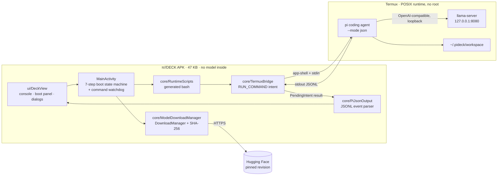
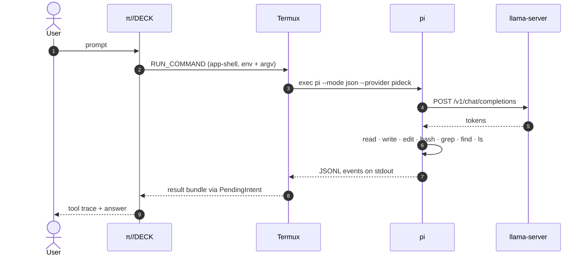

<div align="center">

# π//DECK

**Карманный локальный coding agent для Android**<br/>
**A pocket-sized local coding agent for Android**

Нативная киберпанк-консоль управляет настоящим [Pi](https://github.com/earendil-works/pi),<br/>
а GGUF-модель работает на телефоне через `llama.cpp`. Промпты не покидают устройство.

[](https://github.com/tigrohvost/pi-deck/actions/workflows/build.yml)
[](https://github.com/tigrohvost/pi-deck/releases/latest)
[](https://github.com/tigrohvost/pi-deck/releases)
[](LICENSE)


**[Русский](#-русский) · [English](#-english) · [Архитектура / Architecture](#-архитектура--architecture)**

</div>

---

## 🇷🇺 Русский

APK не содержит многогигабайтную модель — весит 47 KB. При первом запуске деку
проведёт через семь шагов, и она сама:

1. связывается с Termux из F-Droid через защищённый `RUN_COMMAND`;
2. ставит в Termux закреплённую версию Pi, Node.js, Python, `llama.cpp`, git, curl, ripgrep;
3. выбирает профиль Qwen3.5 по объёму RAM и свободному месту телефона;
4. качает один GGUF напрямую с Hugging Face;
5. сверяет закреплённый SHA-256 и поднимает локальный `llama-server`;
6. подключает Pi к `127.0.0.1:8080`;
7. показывает ответы и tool trace в консоли.

> [!NOTE]
> Termux выбран намеренно: он даёт Pi настоящий POSIX-runtime, Python и файловые
> инструменты — без root и без встраивания устаревшего Node.js внутрь APK.

### Что умеет агент

| | |
|---|---|
| 📄 файлы | читать, создавать, редактировать |
| 🐍 код | писать и запускать программы на Python |
| ⌨️ shell | `bash`, `git`, `grep`/`find`/`ripgrep` |
| 🌐 сеть | `curl` и Python внутри Termux |
| 📱 телефон | общие файлы через `~/storage` |
| 💾 сессии | сохранение и продолжение диалога |
| 🧠 модели | смена профиля, освобождение RAM, обновление Pi из интерфейса |

Рабочая директория — `~/.pideck/workspace`, сессии — `~/.pideck/sessions`;
всё в приватном хранилище Termux.

### Требования

- Android 8.0+ и 64-битный процессор (`aarch64` или `x86_64`);
- [Termux из F-Droid](https://f-droid.org/packages/com.termux/) 0.118 или новее — **не** версия из Google Play;
- ~1 GB свободного места под runtime, плюс размер модели.

### Установка

Готовый APK подписан локальным debug-сертификатом для sideload:

**[⬇ Скачать последний релиз](https://github.com/tigrohvost/pi-deck/releases/latest)**

Для магазина нужен отдельный production keystore.

### Модели

| Профиль | RAM телефона | GGUF | Размер |
|:--|--:|:--|--:|
| `NANO` | до 4 GB | Qwen3.5 0.8B Q4_0 | 537 MiB |
| `EDGE` | 6–7 GB | Qwen3.5 2B Q4_K_M | 1.30 GiB |
| `CORE` | 8–15 GB | Qwen3.5 4B Q4_K_M | 2.81 GiB |
| `MAX` | 16+ GB | Qwen3.5 9B Q4_K_M | 5.74 GiB |

Если места мало, рекомендация автоматически опускается на профиль ниже. Любой
профиль можно скачать и выбрать вручную. Источники — `ggml-org` и конверсии
`bartowski`: ссылка закреплена на конкретной ревизии репозитория, файл — на
SHA-256, который дека пересчитывает перед первым запуском.

### Первый запуск

В Termux один раз нужно выполнить скопированную приложением строку:

```sh
mkdir -p ~/.termux && \
  (grep -q '^allow-external-apps=true$' ~/.termux/termux.properties 2>/dev/null || \
  printf '\nallow-external-apps=true\n' >> ~/.termux/termux.properties) && \
  termux-reload-settings && termux-setup-storage
```

Android дополнительно попросит разрешение «Run commands in Termux environment».
Это двойная защита самого Termux: без разрешения **и** без
`allow-external-apps=true` APK не может запустить ни одной команды.

После загрузки модели — `IGNITE LLM`. Пока дека работает, Termux держит
wake-lock; `CORE → STOP LOCAL CORE` освобождает RAM и wake-lock.

### Безопасность

> [!IMPORTANT]
> После явного разрешения пользователя Pi получает shell-возможности Termux —
> именно это позволяет ему программировать на телефоне. Root он не получает и
> приватные данные других приложений не видит.

- промпты и ответы модели идут только на loopback: `network_security_config`
  разрешает cleartext исключительно для `127.0.0.1` и `localhost`;
- интернет нужен для установки пакетов, загрузки модели и для команд, которые
  агент выполняет явно своими инструментами;
- `AGENTS.md` в workspace требует сохранять существующие файлы и объяснять цель
  перед перезаписью или удалением пользовательских данных;
- SharedPreferences исключены из облачного бэкапа и device-transfer.

### Сборка

```sh
./gradlew testDebugUnitTest lintDebug assembleRelease
```

Нужны Android SDK 35 и JDK 17–21 (Gradle 8.10 не запускается на JDK 22+). Если
системная `java` новее, укажите JDK явно:

```sh
./gradlew -Dorg.gradle.java.home=/usr/lib/jvm/java-21-openjdk-amd64 assembleRelease
```

### Ограничения v0.1

- результат и tool trace приходят в UI после завершения очередного Pi turn;
- скорость определяется CPU, охлаждением и выбранным профилем;
- модели меньше 4B годятся для небольших автономных задач, но не заменяют
  крупную серверную coding-модель;
- Android может выгрузить Termux при агрессивной экономии батареи — тогда
  достаточно снова нажать `IGNITE LLM`.

---

## 🇬🇧 English

The APK ships without the model and weighs 47 KB. A seven-step boot sequence
walks you through everything, then the deck:

1. links to Termux from F-Droid over the permission-gated `RUN_COMMAND` channel;
2. installs a pinned Pi release plus Node.js, Python, `llama.cpp`, git, curl and ripgrep inside Termux;
3. picks a Qwen3.5 profile from the phone's RAM and free storage;
4. downloads a single GGUF straight from Hugging Face;
5. verifies the pinned SHA-256 and starts a local `llama-server`;
6. points Pi at `127.0.0.1:8080`;
7. streams answers and the tool trace into the console.

> [!NOTE]
> Termux is a deliberate choice: it gives Pi a real POSIX runtime, Python and
> file tools without root and without bundling a stale Node.js into the APK.

### What the agent can do

| | |
|---|---|
| 📄 files | read, create, edit |
| 🐍 code | write and run Python programs |
| ⌨️ shell | `bash`, `git`, `grep`/`find`/`ripgrep` |
| 🌐 network | `curl` and Python inside Termux |
| 📱 phone | shared storage through `~/storage` |
| 💾 sessions | save and continue a conversation |
| 🧠 models | switch profile, free RAM, update Pi from the UI |

The workspace is `~/.pideck/workspace` and sessions live in
`~/.pideck/sessions`, both inside Termux private storage.

### Requirements

- Android 8.0+ on a 64-bit CPU (`aarch64` or `x86_64`);
- [Termux from F-Droid](https://f-droid.org/packages/com.termux/) 0.118 or newer — **not** the Google Play build;
- ~1 GB free space for the runtime, plus the model size.

### Install

The published APK is signed with a local debug certificate for sideloading:

**[⬇ Download the latest release](https://github.com/tigrohvost/pi-deck/releases/latest)**

Store distribution needs a dedicated production keystore.

### Models

| Profile | Phone RAM | GGUF | Size |
|:--|--:|:--|--:|
| `NANO` | up to 4 GB | Qwen3.5 0.8B Q4_0 | 537 MiB |
| `EDGE` | 6–7 GB | Qwen3.5 2B Q4_K_M | 1.30 GiB |
| `CORE` | 8–15 GB | Qwen3.5 4B Q4_K_M | 2.81 GiB |
| `MAX` | 16+ GB | Qwen3.5 9B Q4_K_M | 5.74 GiB |

When storage is tight the recommendation steps down a tier automatically, and
any profile can be downloaded manually. Sources are `ggml-org` and `bartowski`
conversions: every URL is pinned to a repository revision and every file to a
SHA-256 that the deck recomputes before the first launch.

### First run

Run the command the app copies to your clipboard once, inside Termux:

```sh
mkdir -p ~/.termux && \
  (grep -q '^allow-external-apps=true$' ~/.termux/termux.properties 2>/dev/null || \
  printf '\nallow-external-apps=true\n' >> ~/.termux/termux.properties) && \
  termux-reload-settings && termux-setup-storage
```

Android will also ask for the "Run commands in Termux environment" permission.
That is Termux's own double lock: without both the permission **and**
`allow-external-apps=true` the APK cannot run a single command.

Once the model is on disk, press `IGNITE LLM`. Termux holds a wake-lock while
the deck is in use; `CORE → STOP LOCAL CORE` releases both RAM and wake-lock.

### Security

> [!IMPORTANT]
> After an explicit user grant, Pi inherits Termux shell capabilities — that is
> exactly what lets it program on the phone. It gets no root and cannot read
> other apps' private data.

- prompts and completions never leave loopback: `network_security_config`
  permits cleartext for `127.0.0.1` and `localhost` only;
- the internet is used for package installation, the model download, and
  commands the agent runs explicitly through its own tools;
- the workspace `AGENTS.md` requires preserving existing files and explaining
  the exact target before overwriting or deleting user data;
- SharedPreferences are excluded from cloud backup and device transfer.

### Build

```sh
./gradlew testDebugUnitTest lintDebug assembleRelease
```

Requires Android SDK 35 and JDK 17–21 (Gradle 8.10 refuses JDK 22+). If your
system `java` is newer, point Gradle at a supported JDK:

```sh
./gradlew -Dorg.gradle.java.home=/usr/lib/jvm/java-21-openjdk-amd64 assembleRelease
```

### v0.1 limitations

- the answer and tool trace reach the UI after each Pi turn completes;
- throughput is bound by CPU, thermals and the selected profile;
- sub-4B models handle small autonomous tasks but do not replace a large
  server-side coding model;
- aggressive battery savers can evict Termux — press `IGNITE LLM` again.

---

## 🧠 Архитектура / Architecture

Ни Compose, ни сторонних UI-библиотек: консоль рисуется обычными Android View,
поэтому APK остаётся крошечным и запускается моментально.
*No Compose, no third-party UI runtime — the console is plain Android Views,
which keeps the APK tiny and startup instant.*



### Один prompt-turn / A single prompt turn



### Модули / Modules

| Файл / File | Ответственность / Responsibility |
|:--|:--|
| `MainActivity` | Машина состояний boot-последовательности, watchdog зависших команд, диалоги · Boot-sequence state machine, stalled-command watchdog, dialogs |
| `core/TermuxBridge` | Интент `RUN_COMMAND`, разрешения, `app-shell` + stdin · The `RUN_COMMAND` intent, permissions, `app-shell` + stdin |
| `core/RuntimeScripts` | Генерация bash: probe, установка ядра, старт/стоп сервера, архив сессий, argv для Pi · Generated bash: probe, core install, server start/stop, session archive, Pi argv |
| `core/ModelCatalog` · `ModelSpec` | Четыре профиля с закреплёнными revision + SHA-256, подбор под устройство · Four profiles pinned by revision + SHA-256, device-aware pick |
| `core/ModelDownloadManager` | `DownloadManager`, статус загрузки, потоковая проверка SHA-256 · `DownloadManager`, transfer state, streaming SHA-256 verification |
| `core/PiJsonOutput` | Разбор JSONL-событий Pi, устойчивый к обрезанным строкам · Pi JSONL event parsing, tolerant of truncated lines |
| `core/CommandResult*` · `CommandEvents` | Доставка результата из broadcast-приёмника в активность · Result delivery from the broadcast receiver to the activity |
| `core/DeckPreferences` | Транскрипт, выбранная модель, отложенный результат, флаги проверки · Transcript, selected model, pending result, verification flags |
| `ui/DeckView` | Консоль, статус-рейл, boot-панель, ввод · Console, status rail, boot panel, input |
| `ui/GridBackdropView` · `ScanlineView` | Киберпанк-фон и scanline-оверлей · Cyberpunk backdrop and scanline overlay |

### Инженерные решения / Engineering decisions

| Решение / Decision | Почему / Why |
|:--|:--|
| Termux вместо встроенного runtime · Termux instead of an embedded runtime | Настоящие POSIX, Python и git без root; APK не тащит устаревший Node.js · Real POSIX, Python and git without root; no stale Node.js inside the APK |
| `RUN_COMMAND_RUNNER` **и** `RUN_COMMAND_BACKGROUND` | `RUNNER` появился в termux-shared 0.36.0; стабильный F-Droid 0.118.x читает только boolean, иначе команда уходит в terminal-session и stdin теряется · `RUNNER` landed in termux-shared 0.36.0; F-Droid stable 0.118.x reads the boolean only, otherwise the command becomes a terminal session and stdin is lost |
| Пины revision + SHA-256 · Pinned revision + SHA-256 | Обрыв или подмена GGUF ловится до первой загрузки модели в RAM · A truncated or swapped GGUF is caught before the model ever reaches RAM |
| Watchdog на каждую команду · A watchdog per command | Termux может быть убит Android; без таймаута дека навсегда осталась бы в busy-состоянии · Android can kill Termux; without a timeout the deck would stay busy forever |
| Cleartext только на loopback · Loopback-only cleartext | `llama-server` живёт на HTTP, всё остальное обязано быть TLS · `llama-server` speaks HTTP, everything else must be TLS |
| Скрипты в одном классе · Scripts in a single class | `RuntimeScripts` целиком покрыт `bash -n` и функциональными тестами · `RuntimeScripts` is fully covered by `bash -n` and functional tests |
| Только Android View · Plain Android Views | 47 KB APK, мгновенный старт, никаких транзитивных зависимостей · A 47 KB APK, instant startup, zero transitive dependencies |

### Тесты / Tests

`./gradlew testDebugUnitTest` — 15 JVM-тестов без эмулятора: синтаксис всех
генерируемых скриптов (`bash -n`), реальный прогон архивации сессий во временном
`HOME`, валидность `models.json` для Pi, разбор JSONL, подбор профиля по RAM и
месту, целостность пинов каталога.

*15 JVM tests, no emulator required: `bash -n` over every generated script, a
real run of the session-archive script against a temporary `HOME`, `models.json`
validity for Pi, JSONL parsing, RAM/storage-aware profile selection, and catalog
pin integrity.*

---

<div align="center">

**MIT** · Pi by [earendil-works](https://github.com/earendil-works/pi) · inference by [llama.cpp](https://github.com/ggml-org/llama.cpp) · runtime by [Termux](https://github.com/termux/termux-app)

</div>
