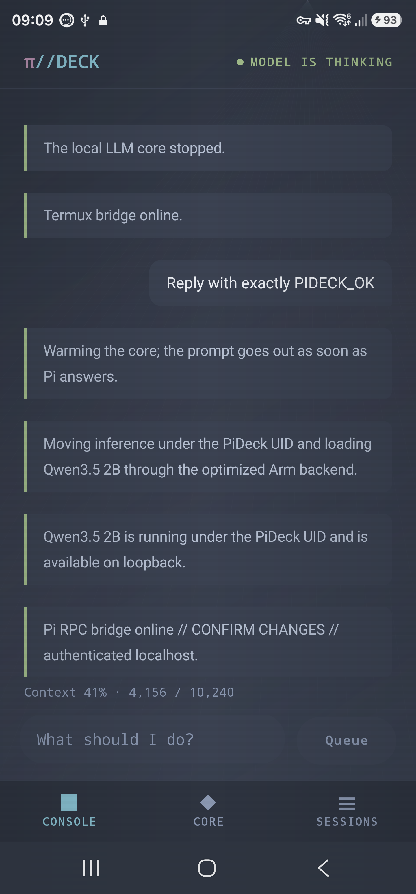
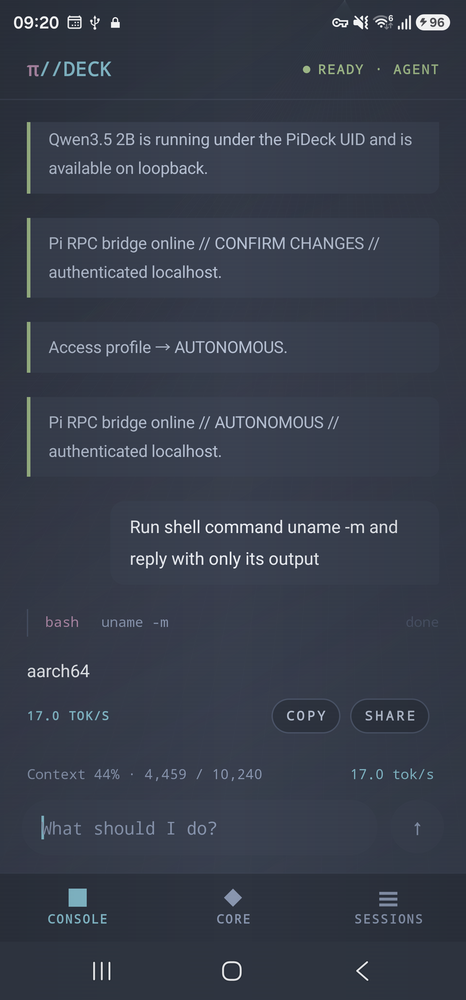
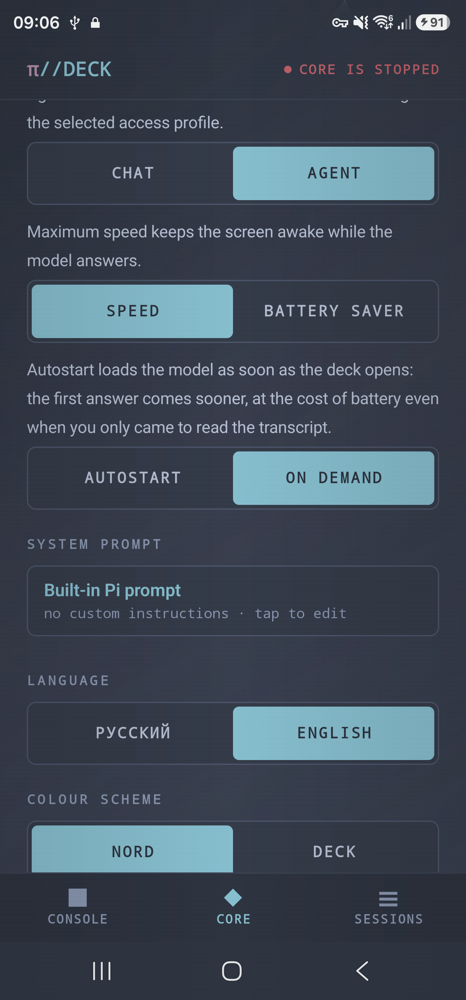
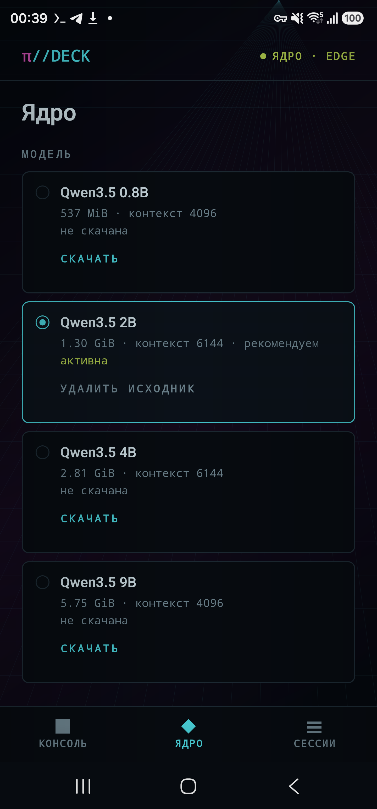

<div align="center">

# π//DECK

**Локальный coding agent для Android через Termux**

[English](README.md) · [Русский](README.ru.md)

[](https://github.com/tigrohvost/pi-deck/actions/workflows/build.yml)
[](LICENSE)

**[Скачать APK последнего релиза](https://github.com/tigrohvost/pi-deck/releases/download/v0.3.0-alpha15/pi-deck.apk)**

</div>

Агент [Pi](https://github.com/earendil-works/pi) целиком живёт в телефоне.
Модель считает foreground-сервис Android-приложения, а shell, файлы, Python и
сессии находятся в Termux. Компоненты связаны аутентифицированным loopback RPC,
root не нужен.

> [!WARNING]
> Локальный инференс — не песочница ОС. В зависимости от профиля инструменты
> работают правами пользователя Termux и могут ходить в сеть. Явно вызванные
> web-инструменты делают собственные запросы, хотя инференс модели остаётся на
> устройстве.

## Релиз и проверки на устройстве

Текущая версия исходников — `0.3.0-alpha15` (`versionCode 23`): исправления
перекрытий на узких экранах, накопленные изменения runtime и автоматическая
сборка APK с production-подписью. Прежние измерения alpha14 сохранены в
[результатах проверок](docs/validation/alpha14); они не заменяют проверку нового
подписанного CI APK на телефоне.

Ранее сборка `0.3.0-alpha13` (`versionCode 21`, runtime contract 56) была
проверена следующим образом. 26 августа 2026 года её точный debug APK прошёл handset-acceptance на
Samsung SM-S918B: `READY · AGENT`, точный `PIDECK_OK`, реальный UUID через
одноразово подтверждённый `pideck_bash`, диагностика операций и
background/resume завершились без crash или LMK. Выбранный профиль LFM2.5 2.6B
QAD Q4_0 использует контекст 10 240 и нативный reasoning-cap 256 токенов;
профиль отображается одновременно как `рекомендуем` и `активна`.
Во время активной задачи строка метрик теперь остаётся однострочной:
контекст сжимается до `CTX ≈10% · 986/10240`, а для accessibility сохраняется
полное локализованное значение. Layout проверен на телефоне при 360 dp,
максимальном внутриприложенческом масштабе текста и на обоих языках UI.

Gate contract 56 прошёл Gradle unit/lint/debug/androidTest/unsigned-release,
121 runtime-тест, 47 tooling-тестов, контракт 12 extensions/9 tools, smoke
закреплённого Pi RPC, валидатор контракта из 28 benchmark-задач и указанный выше
exact-APK прогон на телефоне. Принятый debug APK подписан Android
Debug-сертификатом и предназначен только для sideload; неподписанный release-
артефакт не выдаётся за production release.

## Как это выглядит

| Запрос на холодном ядре уходит сам | Агент выполняет команду |
|:--:|:--:|
|  |  |
| **Ядро, модель, режим и автозапуск** | **Альтернативная палитра DECK** |
|  |  |

## Что работает внутри

- инференс выполняется под UID PI//DECK в foreground-сервисе: открытая дека
  получает CPU-set `top-app`, а не фоновые ядра Termux;
- Pi 0.82.1, shell, Python, рабочая папка и сессии работают в Termux;
- приложение и Termux общаются по `127.0.0.1` с случайным 256-битным токеном;
- GGUF проверяется по SHA-256, копируется в приватное хранилище и становится
  read-only;
- штатные модели используют закреплённый `llama.cpp b10092`, а Nanbeige —
  отдельный закреплённый Android-sidecar, который не может подменить сервер
  остальных моделей.
- Function-инструменты Pi передают обычные OpenAI-совместимые схемы без strict
  sampler-grammar: это обходит сбой grammar-parser в b10092, сохраняя проверку
  инструментов и ограничения разрешений в bridge;
- автоматическая capacity-gated лестница — LFM2.5 2.6B QAD Q4_0 → Qwen3.5 2B
  → 0.8B. QAD использует нативный reasoning с cap 256 токенов, а Pi получает
  контракт только текущей активной модели;
- вручную выбранная Qwen3.5 4B сохраняет адаптивный FAST/DEEP с reasoning-cap
  512 токенов. Схема инструментов в сессии только растёт, поэтому новый
  промпт переиспользует префикс llama.cpp вместо повторного prefill всей беседы;
- короткий прямой вопрос о текущих данных получает ровно один bounded web- или
  weather-инструмент и cap 256 токенов на оба provider-хода; многошаговое
  исследование остаётся на обычном agent-маршруте;
- маленькие явно названные файлы scoped-repair читаются bounded-prefetch до
  первого model request. Их восьмизначные `line:hash`-якоря опираются на точные
  снимки байтов; невидимые и устаревшие якоря отклоняются, а принятая правка
  проходит через `fsync` и атомарный `rename`;
- большие исходники сначала дают outline объявлений, точный диапазон доступен по
  запросу, а из provider-контекста можно удалить только старый байт-в-байт
  одинаковый результат, не переписывая durable session history;
- корневые Copilot instructions, вложенные `AGENTS.md` и подходящие Cursor rules
  применяются к конкретному пути. Shell-чтения и поиски направляются в managed
  tools, а критические широкие команды требуют `CONFIRM_CHANGES`.
- `PLAN` добавляет опциональную нативную границу: сначала Pi получает только
  read-only tools, Android показывает bounded-план из 3–7 шагов, и исполнение
  начинается лишь после явного решения с TTL две минуты. Обычные запросы не
  получают дополнительный model round, а выбранный профиль доступа не шире.

## Требования

- Android 8.0 / API 26+, arm64;
- [Termux 0.118.0+ из F-Droid](https://f-droid.org/packages/com.termux/);
- место одновременно под скачанный GGUF и его приватную проверенную копию;
- Node.js 22.19.0+ внутри Termux. Нужные пакеты устанавливает `INSTALL CORE`.

## Быстрый старт

1. Установите Termux и выдайте PI//DECK разрешение `RUN_COMMAND`.
2. Нажмите `COPY + OPEN`, вставьте созданную строку в Termux и выполните её.
   Эквивалентная команда:

   ```sh
   mkdir -p ~/.termux && \
     (grep -q '^allow-external-apps=true$' ~/.termux/termux.properties 2>/dev/null || \
     printf '\nallow-external-apps=true\n' >> ~/.termux/termux.properties) && \
     termux-reload-settings && \
     ([ -d "$HOME/storage/downloads" ] || termux-setup-storage)
   ```

3. Нажмите `INSTALL CORE`. Установщик разворачивает закреплённый Pi, Python и
   инструменты, не перезаписывая `~/.pideck/workspace/AGENTS.md`. Если выбранное
   зеркало Termux сообщает рассинхрон размера или хэша индекса, только для этой
   операции используется подписанный официальный `packages.termux.dev`;
   пользовательский выбор репозитория не переписывается.
4. Выберите модель в `ЯДРО`, нажмите `DOWNLOAD`, затем `VERIFY`. После установки
   приватной проверенной копии shared incoming-файл остаётся отдельно.
5. Отправьте запрос. Холодная дека поставит его в очередь, прогреет модель и
   передаст Pi после готовности RPC. `ЯДРО → Автозапуск` умеет прогреть её раньше.
6. Для крупного изменения включите `PLAN` перед отправкой или начните запрос с
   `/plan `. Проверьте read-only план-карточку и выберите `Выполнить` или `Отмена`.

Расположение данных:

```text
~/.pideck/workspace/     рабочая папка агента и AGENTS.md
~/.pideck/sessions/      долговечные сессии Pi
~/.pideck/runtime/       versioned Python/Pi runtime
~/.pideck/logs/          диагностика компонентов
Android app data/        приватная read-only GGUF и лог native-сервера
```

## Профили доступа

| Профиль | Поведение |
|---|---|
| `AUTONOMOUS` | По умолчанию; shell и изменения файлов выполняются как пользователь Termux без подтверждения каждой команды |
| `CONFIRM_CHANGES` | `bash`, edit и write требуют одноразового Android-подтверждения с TTL |
| `READ_ONLY` | Чтение, поиск и ограниченные managed-инструменты `web_search`/`weather` |

Профиль выбирается в `ЯДРО → Доступ`. Рабочая папка — полезная граница, но не
песочница ОС. Закрытие UI, timeout, disconnect или restart bridge отклоняют
ожидающее подтверждение.

> [!WARNING]
> Дека, обновлённая с alpha7 и никогда вручную не менявшая профиль, переходит на
> `AUTONOMOUS`. Это намеренное расширение прав, которое показывает consent flow.

## Настройки `ЯДРО`

- **Режим** — Агент с инструментами и файлами либо Чат с прямым ответом;
- **Автозапуск** — загружать выбранную модель при открытии; по умолчанию выключен;
- **Таймаут ядра** — режим «Умно» хранит малый контекст 10 минут, а заполненный
  хотя бы на 40% — 30 минут; остаются фиксированные 5/10/30 минут и «Всегда»;
- **Передышка** — опционально ждать восстановления частоты (до 60 с) перед отправкой;
- **Системный промпт** — дополнить встроенный промпт Pi или заменить целиком;
- **Язык** — русский или английский UI без изменения сообщений;
- **Максимальная скорость** — не гасить экран во время инференса.

## Модели

Модель остаётся `EXPERIMENTAL` или ручным `CANDIDATE`, пока не завершены
provenance и полный device admission suite. Неизвестный model ID никогда не
подменяется рекомендацией молча.

Автоматическая лестница теперь выбирает официальный
[LFM2.5 2.6B QAD Q4_0](https://huggingface.co/LiquidAI/LFM2.5-2.6B-GGUF),
если запас свободной RAM и места проходит guard, иначе отступает к Qwen3.5 2B
и 0.8B. На SM-S918B со штатным b10092 QAD показал 16,47 ток/с на 128 токенах
и 15,71 ток/с на 192 токенах против 12,32 ток/с у Q4_K_M. Сохранённый ручной
выбор не мигрирует; Qwen3.5 4B и более крупные профили остаются явным выбором.
Полный 28-задачный admission suite ещё не завершён.

| Модель | Статус | Runtime и фактические доказательства |
|---|---|---|
| Qwen3.5 0.8B / 2B / 4B / 9B | `EXPERIMENTAL` | Штатный b10092, неизменяемые артефакты. Для Qwen 2B пройдены приватный SHA, server и Pi smoke |
| LFM2.5 2.6B Q4_K_M | `CANDIDATE` | Штатный b10092; ручной выбор после точного 192-token замера 12,32 ток/с |
| LFM2.5 2.6B QAD Q4_0 | `EXPERIMENTAL` | Официальный неизменяемый QAD-артефакт на штатном b10092; 16,47/15,71 ток/с на 128/192 токенах и валидный цикл `read` → правильный `edit` → финальный ответ с reasoning-cap 256; полный suite ещё впереди |
| Ministral 3 3B Instruct | `CANDIDATE` | Официальный GGUF на штатном b10092. На SM-S918B пройдены скачивание, SHA/private install, запуск и Pi-ходы со схемами инструментов; полный suite и русский язык ещё не проверены |
| Nanbeige4.2 3B | `CANDIDATE` | Закреплённый Q4_K_M и изолированный sidecar `nanbeige42-c6640a1`. На SM-S918B пройдены скачивание и SHA/private install; inference suite ещё не запускался |
| Bonsai 27B | `CANDIDATE` | Ручной 1-битный эксперимент: около 1,16 ток/с, хотя памяти требуется меньше, чем Qwen 4B |

Первый smoke Ministral на телефоне показал около 23,2 prompt tok/s и 0,5 decode
tok/s для ответа из шести токенов. Это доказательство совместимости, а не
рекомендация. Строгий embedded-шаблон также отвергает старую сессию, которая
заканчивается незакрытым user-ходом; новая сессия сохраняет старую историю и
восстанавливает корректное чередование ролей.

Новые модели проходят [`tools/pin_model.py`](tools/pin_model.py), проверку
лицензии, неизменяемые revision/size/SHA и 28-задачный device benchmark.
Популярность репозитория не является критерием admission.

## Сборка и тесты

Нативные arm64-файлы восстанавливаются из закреплённых исходников, а не хранятся
в Git. Штатно-совместимый runtime — b10092 с закреплённым по SHA набором
Android/server-патчей `pideck-affinity1`; для него нужен NDK 27.1. Изолированному
Nanbeige-sidecar нужен NDK 28.2, обе сборки используют Android CMake 3.22.1:

```sh
ANDROID_NDK_ROOT="$ANDROID_HOME/ndk/27.1.12297006" \
  PIDECK_NANBEIGE_NDK_ROOT="$ANDROID_HOME/ndk/28.2.13676358" \
  ./tools/vendor_llama_android.sh
```

```sh
./gradlew -Dorg.gradle.java.home=/usr/lib/jvm/java-21-openjdk-amd64 \
  testDebugUnitTest lintDebug assembleDebug assembleRelease
PYTHONDONTWRITEBYTECODE=1 python3 -W error::ResourceWarning \
  -m unittest discover -s tests/runtime -v
python3 -m unittest discover -s tests/tools -v
python3 tools/validate_benchmark.py
```

Подписанный APK автоматически собирается при каждом push в `main` и доступен
в артефакте Actions `pi-deck-signed-release`. Версионный тег публикует APK,
контрольные суммы и исходный коммит в [GitHub Releases](https://github.com/tigrohvost/pi-deck/releases).
Альфа-версии отмечаются как prerelease. При переходе со старого тестового APK
с debug-подписью см. [подпись и перенос данных](docs/release-process.md).

JDK 21 обязателен. Без production signing secrets release APK остаётся unsigned:
debug-ключ никогда не подставляется в release. Публикуемый релиз дополнительно
требует verified tag, checksums и CycloneDX SBOM с обоими native runtime.

## Документация

- [English README](README.md)
- [Changelog](CHANGELOG.md)
- [Architecture](docs/architecture.md)
- [Security model](docs/security-model.md)
- [RPC bridge](docs/rpc-bridge.md)
- [Model admission](docs/model-admission.md)
- [Compatibility matrix](docs/compatibility-matrix.md)
- [ADB performance evidence](docs/performance.md)
- [Release process](docs/release-process.md)
- [Architecture decisions](docs/adr/README.md)

## Лицензия

[MIT](LICENSE)
