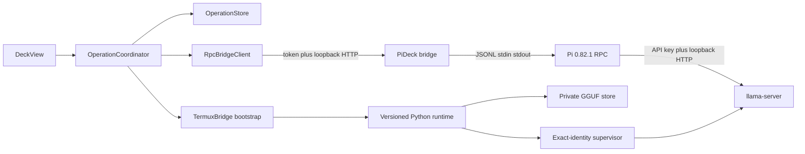

# Architecture

PI//DECK keeps bootstrap and interactive traffic separate.

Android creates a canonical UUIDv4 before dispatch. That `operationId` is
preserved by the durable record, Termux callback, bridge command, normalized
events, watchdog, approval and abort. One mutating operation may be active.
Late results remain history and cannot complete a newer operation.

`RUN_COMMAND` is retained only for installing assets, private model copies,
starting/stopping supervisors and recovery. Prompts use authenticated RPC and
do not enter argv. A bounded event journal lets a recreated Activity resume by
`bridgeInstanceId` and sequence; an event gap triggers full state reconcile and
never a hidden prompt replay.

`models-v2.json` is the catalog used by Android, the downloader, installer,
server argument builder and Pi provider generator. A GGUF becomes runnable only
after Android incoming verification, a second streaming hash during private
copy, fsync, same-filesystem atomic rename, read-only mode and a full pre-start
private hash.

The current Activity still owns presentation wiring. Process, protocol,
catalog, persistence and transport rules have been extracted into testable
components; a future ViewModel extraction is non-security-critical follow-up.
