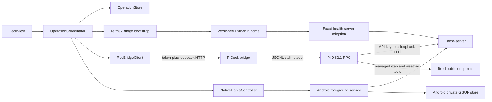

# Architecture

PI//DECK keeps bootstrap and interactive traffic separate.

Android creates a canonical UUIDv4 before dispatch. That `operationId` is
preserved by the durable record, Termux callback, bridge command, normalized
events, watchdog, approval and abort. One mutating operation may be active.
Late results remain history and cannot complete a newer operation.

`RUN_COMMAND` is retained only for installing Termux assets, provider adoption,
bridge lifecycle and recovery. Prompts use authenticated RPC and
do not enter argv. A bounded event journal lets a recreated Activity resume by
`bridgeInstanceId` and sequence; an event gap triggers full state reconcile and
never a hidden prompt replay.

Pi's package/extension API remains the integration seam, but automatic package
discovery is disabled. The APK explicitly installs and loads a small web-tools
extension alongside the prompt/cache/context guards. This keeps the available
network surface reproducible while still giving weak local models structured
`web_search` and `weather` calls instead of requiring them to invent shell
pipelines.

The Core screen persists an optional custom system prompt in Android-private
preferences. Bridge bootstrap carries it in stdin JSON, turns it into a private
fixed file, then a pinned explicit Pi 0.82.1 extension applies append/replace at
the final per-turn hook. Only a fingerprint returns through state, so changing
the setting makes an old bridge non-ready and triggers a controlled restart.

The same private preferences hold the selected Russian or English presentation
language. Recreating the Activity applies it to all deck chrome while preserving
the transcript; user prompts and agent answers are never translated. A completed
agent entry also persists the terminal `outputTokens` and `tokensPerSecond`, so
its exact rate stays attached to that answer after recreation.

`models-v2.json` is the catalog used by Android, the downloader, installer,
native server argument builder and Pi provider generator. A GGUF becomes runnable only
after Android incoming verification, a second streaming hash during private
copy, fsync, same-filesystem atomic rename and exact read-only mode.

The current Activity still owns presentation wiring. Process, protocol,
catalog, persistence and transport rules have been extracted into testable
components; a future ViewModel extraction is non-security-critical follow-up.
