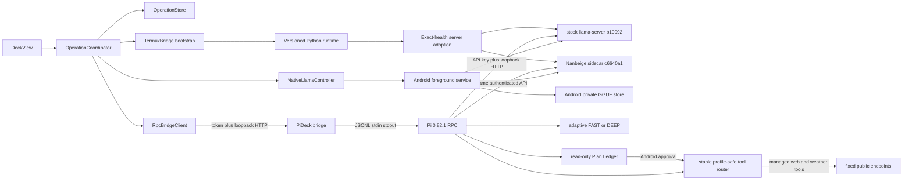

# Architecture

PI//DECK keeps bootstrap and interactive traffic separate.

```mermaid
flowchart LR
  UI[DeckView] --> OC[OperationCoordinator]
  OC --> OS[OperationStore]
  OC --> TC[TermuxBridge bootstrap]
  OC --> RC[RpcBridgeClient]
  OC --> NC[NativeLlamaController]
  NC --> NS[Android foreground service]
  NS --> LS[stock llama-server b10092]
  NS --> NB[Nanbeige sidecar c6640a1]
  NS --> MS[Android private GGUF store]
  TC --> RT[Versioned Python runtime]
  RC -->|token plus loopback HTTP| BR[PiDeck bridge]
  BR -->|JSONL stdin stdout| PI[Pi 0.82.1 RPC]
  PI -->|API key plus loopback HTTP| LS
  PI -->|same authenticated API| NB
  PI --> AT[adaptive FAST or DEEP]
  PI --> TR[stable profile-safe tool router]
  PI --> PL[read-only Plan Ledger]
  PL -->|Android approval| TR
  TR -->|managed web and weather tools| WEB[fixed public endpoints]
  RT --> AD[Exact-health server adoption]
  AD --> LS
  AD --> NB
```

Android creates a canonical UUIDv4 before dispatch. That `operationId` is
preserved by the durable record, Termux callback, bridge command, normalized
events, watchdog, approval and abort. One mutating operation may be active.
Late results remain history and cannot complete a newer operation.

`RUN_COMMAND` is retained only for installing Termux assets, provider adoption,
bridge lifecycle and recovery. Prompts use authenticated RPC and
do not enter argv. A bounded event journal lets a recreated Activity resume by
`bridgeInstanceId` and sequence; an event gap triggers full state reconcile and
never a hidden prompt replay.

Termux link health, runtime installation, native server health and authenticated
bridge readiness are separate facts. Launch probes the link even when runtime is
incomplete, preserves the last confirmed fact through one cold-receiver retry,
and shows repair instructions only after a final failure.

Pi's transcript remains the durable conversation authority. The bridge also
writes an atomic non-sensitive checkpoint with session ID, context/message
counters, the last terminal operation, and a bounded Plan Ledger of at most
seven short steps; after restart the counters are estimated until Pi reports
fresh state. Plan goals and steps are working-session data, not diagnostics,
and are not copied into the approval audit. No disk KV/slot cache is claimed
for hybrid-recurrent Qwen3.5.

Pi's package/extension API remains the integration seam, but automatic package
discovery is disabled. The APK explicitly installs and loads a small web-tools
extension and a profile-safe tool router alongside the prompt/cache/context
guards. Pi receives the complete hard allowlist for the selected access profile,
then the router activates only its compact core. Explicit live-data prompts add
the matching managed tools before the first model call; other optional groups
can be loaded without ever crossing the selected profile. Within a session the
provider schema only ever grows: llama.cpp renders `tools` inside the system
turn, so a task-specific restriction (one explicit tool, a read-only navigation,
a bounded repair) is enforced by the `tool_call` guard and announced in a short
`PI//DECK TASK TOOLS` note at the end of the context instead of by rewriting
the schema. The cache guard likewise ignores sampling-only fields such as
`max_tokens` and the per-turn `enable_thinking` switch, so a new prompt in the
same process reuses the growing prefix. This keeps the network surface
reproducible while avoiding permanent schemas for capabilities an ordinary
local task does not need.

Planning is a one-shot Android-selected mode, not another autonomous agent. The
first pass permits only `read`, `code_nav`, managed web search, and weather: a
`tool_call` guard rejects every other name while the provider schema stays
unchanged, so neither the plan nor the execution turn replays the session.
Only a parsed `Plan:`/`План:` section with 3–7 sequential steps can cross the
bridge as a plan decision. Android owns the two-minute Execute/Cancel card. An
approval queues one Pi follow-up; denial, timeout, disconnect, abort, or unsupported Chat/READ_ONLY
mode cannot start execution. `[DONE:n]` and `[BLOCKED:n]` markers update the
checkpoint and are removed from the user-visible terminal answer.

Reasoning-capable Qwen turns are classified once at input: direct/read-only/Chat
work uses FAST, while repairs and diagnosis retain bounded DEEP. The session's
tool schema stays fixed across results and prompts so llama.cpp can reuse the
growing exact prefix; one-shot, retry, and terminal restrictions live in
execution guards.
For an explicitly scoped repair, a small fail-closed prefetch can inject complete
user-named files with the same line-hash anchors before the first model call.
Those anchors are backed by an in-memory exact-byte snapshot and by the set of
lines actually delivered to the model. Large source reads default to a bounded
declaration outline; an explicit offset/limit returns the exact editable range.
An accepted edit is fully preflighted and committed by same-directory fsync and
atomic rename; the result then carries the current anchors of the changed range
backed by a fresh snapshot of the committed bytes, so a follow-up edit of the
same file needs no extra read round.

Before the model acts on a known target—and at latest alongside its first
managed read result—the router deterministically merges applicable repository
guidance: the root Copilot file, nested `AGENTS.md` files from shallow to deep,
and matching or always-on Cursor rules. Content, file count and total bytes are
bounded, symlinks and workspace escapes are rejected, and a mutation is stopped
once if newly discovered rules have not yet reached the model.

The context guard may replace old provider-facing copies of byte-identical
`read`/`code_nav` results with small markers once the saving is material. Pi's
durable transcript remains untouched. The local-cache hook sees the rewritten
prefix and disables recurrent-state reuse for that request; caching resumes only
after the pruned prefix itself is stable.

The Core screen persists an optional custom system prompt in Android-private
preferences. Bridge bootstrap carries it in stdin JSON, turns it into a private
fixed file, then a pinned explicit Pi 0.82.1 extension applies append/replace at
the final per-turn hook. Only a fingerprint returns through state, so changing
the setting makes an old bridge non-ready and triggers a controlled restart.

The same private preferences hold the selected Russian or English presentation
language. Recreating the Activity applies it to all deck chrome while preserving
the transcript; user prompts and agent answers are never translated. A completed
agent entry also persists the terminal `outputTokens` and `tokensPerSecond`, so
its exact rate stays attached to that answer after recreation.

`models-v2.json` is the catalog used by Android, the downloader, installer,
native server argument builder and Pi provider generator. A GGUF becomes runnable only
after Android incoming verification, a second streaming hash during private
copy, fsync, same-filesystem atomic rename and exact read-only mode.

The current Activity still owns presentation wiring. Process, protocol,
catalog, persistence and transport rules have been extracted into testable
components; a future ViewModel extraction is non-security-critical follow-up.
