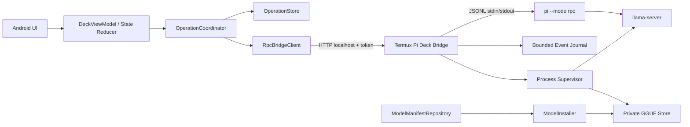

# PI//DECK — спецификация hardening, RPC-транспорта и каталога свободных моделей

**Версия спецификации:** 1.0<br>
**Дата:** 2026-07-26<br>
**Целевой репозиторий:** <https://github.com/tigrohvost/pi-deck><br>
**Исполнитель:** Codex или другой coding-agent<br>
**Целевая платформа:** Android 8+ / Termux без root
**Язык реализации:** сохранить текущий стек проекта; Java 17, Android Views, shell/Python внутри Termux там, где это оправдано

---

## 1. Назначение документа

Эта спецификация описывает последовательную доработку PI//DECK в трёх направлениях:

1. устранение ошибок корректности, гонок, небезопасного управления процессами и слабых мест жизненного цикла GGUF-моделей;
2. переход от одноразовых команд Termux к устойчивому двустороннему RPC-транспорту с потоковыми событиями, точной корреляцией запросов и корректным abort;
3. создание единого воспроизводимого каталога свободных моделей с модельно-специфичными параметрами запуска, проверкой лицензий и аппаратным benchmark-gate.

Документ должен использоваться как самостоятельное задание. Перед началом исполнитель обязан изучить фактический код текущего `main`; описанные ниже имена файлов и наблюдения относятся к состоянию репозитория, проверенному 2026-07-26, но не заменяют анализ актуального HEAD.

---

## 2. Обязательные действия перед изменениями

Исполнитель **MUST**:

1. клонировать или открыть репозиторий;
2. сохранить исходный commit:

   ```bash
   git rev-parse HEAD
   ```

3. записать commit в `docs/implementation-baseline.md`;
4. выполнить исходную сборку и тесты;
5. зафиксировать фактически установленную и поддерживаемую версию Pi, формат RPC и доступные параметры `llama-server`;
6. не полагаться на предположения из этой спецификации, когда поведение можно проверить исходным кодом, `--help`, официальной документацией или автоматическим тестом;
7. при расхождении актуального кода со спецификацией сохранить целевое свойство и описать отклонение в ADR.

Минимальный baseline-check:

```bash
./gradlew testDebugUnitTest
./gradlew lintDebug
./gradlew assembleDebug
```

При наличии release-конфигурации и ключа:

```bash
./gradlew assembleRelease
```

Shell-файлы и генерируемые скрипты должны проходить хотя бы:

```bash
bash -n <script>
```

Python-компоненты:

```bash
python -m compileall <path>
python -m unittest discover -s <tests_path>
```

---

## 3. Термины требований

- **MUST / MUST NOT** — обязательное требование.
- **SHOULD / SHOULD NOT** — требование можно отклонить только с документированным техническим основанием.
- **MAY** — допустимое расширение.
- **Операция** — один запрос Android-приложения к Termux-компоненту с уникальным `operationId`.
- **Agent turn** — один пользовательский запрос к Pi, включая все вызовы инструментов и итоговый ответ.
- **Модельный артефакт** — конкретный GGUF-файл, определённый репозиторием, неизменяемой ревизией, именем файла, размером и SHA-256.
- **Свободная модель** — модель, распространяемая на условиях OSI-совместимой или эквивалентной разрешительной лицензии для весов и кода, принятой проектом. Для первой версии allowlist: Apache-2.0 и MIT. Модели с `qwen-research`, gated/custom/non-commercial лицензиями не считать свободными по умолчанию.
- **Локальный inference** — генерация выполняется локальным `llama-server`; это не означает, что инструменты агента изолированы от сети.
- **Network-isolated** — процесс технически лишён сетевого доступа на уровне ОС или проверенного sandbox-механизма. Переменная окружения не удовлетворяет этому определению.

---

## 4. Цели и измеримый результат

После выполнения спецификации система должна обеспечивать:

1. точное сопоставление каждого ответа, события, watchdog и abort с полным `operationId`;
2. невозможность повторного запуска mutating turn из-за эвристики по тексту ошибки;
3. остановку только того процесса или process group, который принадлежит конкретной операции;
4. запуск только проверенной приватной копии GGUF, а не файла из общей папки Downloads;
5. отсутствие полного prompt в argv и системном process list;
6. сохранение пользовательского `AGENTS.md` при переустановке и обновлении;
7. отсутствие установки Pi через `@latest`;
8. единый `models-v2.json`, используемый Android, installer, runtime и benchmark;
9. модельно-специфичные chat template, sampling, context и tool-calling настройки;
10. потоковые события agent turn после внедрения RPC-моста;
11. явные профили доступа к инструментам: read-only, confirm changes, autonomous;
12. аппаратно подтверждённый процесс допуска новой модели в каталог;
13. воспроизводимый подписанный release-процесс.

---

## 5. Ограничения и нецели

### 5.1. Ограничения

- Android API 26+.
- Работа без root.
- Основной runtime находится в Termux.
- Не включать GGUF в APK.
- Сохранять работоспособность текущих Qwen3.5-профилей.
- Не вводить облачные обязательные компоненты.
- Избегать тяжёлых Android-зависимостей без необходимости.
- Не переходить на Compose в рамках этой работы.
- Не переписывать всё приложение одним PR.
- Все миграции настроек и данных должны быть обратимо или безопасно восстанавливаемы.

### 5.2. Нецели

В эту работу не входят:

- доказанная криптографическая защита от root или модифицированной ОС;
- полноценная виртуальная машина или kernel-level sandbox для shell-команд;
- обучение или дообучение моделей;
- гарантированное качество ответов LLM вне benchmark-набора;
- автоматическое принятие моделей только по публичным leaderboard;
- превращение PI//DECK в универсальный менеджер всех GGUF;
- обязательная поддержка параллельных agent turns. В первой версии допускается один активный turn.

---

## 6. Подтверждённые проблемы исходной реализации

Исполнитель должен повторно проверить каждую проблему на актуальном HEAD.

| ID | Приоритет | Компонент | Исходное поведение | Требуемое состояние |
|---|---:|---|---|---|
| BASE-001 | P0 | `CommandResult` / `MainActivity` | UUID отбрасывается при сопоставлении результата по `kind`; результат привязывается к типу операции | Полный `operationId` используется сквозным образом |
| BASE-002 | P0 | `DeckPreferences` | Один слот pending-result в SharedPreferences | Durable store с отдельной записью на каждую операцию |
| BASE-003 | P0 | `MainActivity` | Ошибка, содержащая `session`, способна вызвать автоматический повтор agent turn | Mutating turn никогда не повторяется по текстовой эвристике |
| BASE-004 | P0 | `RuntimeScripts` | Abort через `pkill -INT -f` | Остановка точного PID/process group после проверки identity |
| BASE-005 | P0 | `RuntimeScripts` | Сервер останавливается по PID-файлу без проверки start time и cmdline | Проверяемая process identity и конечный автомат supervisor |
| BASE-006 | P0 | `ModelDownloadManager` | GGUF запускается из общей Downloads-папки; verification не защищает от последующей подмены | Приватная атомарно установленная копия и проверка перед запуском |
| BASE-007 | P0 | `RuntimeScripts` | Prompt передаётся как аргумент Pi | Prompt передаётся через stdin или RPC |
| BASE-008 | P0 | `RuntimeScripts` | `AGENTS.md` перезаписывается installer-скриптом | Пользовательский файл сохраняется; шаблон отделён |
| BASE-009 | P0 | update path | Pi обновляется через `@latest` | Только совместимая закреплённая версия и rollback |
| BASE-010 | P1 | model catalog | Java-каталог и Pi `models.json` дублируют данные | Один источник истины `models-v2.json` |
| BASE-011 | P1 | runtime | Один Qwen-oriented набор параметров применяется ко всем моделям | Параметры задаются модельным профилем |
| BASE-012 | P1 | model selection | Неизвестный model ID молча превращается в EDGE | Неизвестный ID — явная ошибка |
| BASE-013 | P1 | health | Model ID определяется поиском подстроки в HTTP body | Строгий JSON parse и exact match |
| BASE-014 | P1 | parser | Глобальная замена `\\n` способна портить строки и пути | Только корректный JSON decode |
| BASE-015 | P1 | lifecycle | `MainActivity` совмещает UI, процессы, downloads, polling, session и result handling | Логика разделена на тестируемые компоненты |
| BASE-016 | P1 | privacy/UI | Формулировки могут смешивать local inference и network isolation | Точная индикация возможностей и рисков |
| BASE-017 | P2 | release | Release использует debug signing | Постоянный release key, checksums, signed tag |
| BASE-018 | P2 | tests | Основные lifecycle/device-race сценарии не покрыты | JVM + instrumentation + реальное устройство |

### 6.1. Уточнение про `--approve`

В актуальной ветке Pi флаг `--approve` следует трактовать согласно фактической версии CLI и её документации. Для Pi 0.82.x он относится к доверию к проекту/проектным инструкциям, а не обязательно к автоматическому подтверждению каждого tool call.

Исполнитель **MUST NOT** описывать `--approve` как разрешение всех инструментов без проверки документации. Реальная автономность текущего режима обусловлена прежде всего включённым набором `bash/edit/write` и отсутствием permission-gate.

---

## 7. Целевая архитектура

### 7.1. Этап A: hardening текущего одноразового транспорта

До RPC-миграции необходимо исправить самые опасные ошибки без крупной перестройки:

```text
MainActivity/UI
      |
      v
OperationCoordinator
      |
      +--> OperationStore (AtomicFile / app-private storage)
      |
      +--> TermuxCommandClient
                |
                v
       Termux RUN_COMMAND
                |
                v
       exact operation wrapper
       + PID/starttime metadata
       + stdout/stderr result
       + atomic completion record
```

### 7.2. Этап B: постоянный RPC-мост

Предпочтительная итоговая архитектура:



### 7.3. Android-компоненты

Создать или выделить следующие роли. Конкретные package names можно адаптировать к проекту.

- `OperationCoordinator` — конечный автомат операций, единственная точка запуска/abort/reconcile.
- `OperationStore` — атомарное app-private хранение операций и результатов.
- `TermuxCommandClient` — запуск bootstrap/installer/bridge-команд через Termux API.
- `RpcBridgeClient` — authenticated long-poll/SSE client к мосту.
- `ServerSupervisorClient` — команды start/stop/status модели через bridge.
- `ModelManifestRepository` — загрузка и строгая валидация `models-v2.json`.
- `ModelInstaller` — orchestration загрузки, проверки и приватной установки.
- `AgentProfileRepository` — read-only/confirm/autonomous profile.
- `HealthClient` — строгий parse health/model endpoints.
- `DeckViewModel` или независимый reducer — presentation state без process logic.

`MainActivity` должна остаться преимущественно слоем UI и lifecycle wiring.

### 7.4. Termux-компоненты

Разрешается использовать Python standard library, уже устанавливаемый проектом.

Рекомендуемые файлы:

```text
~/.pideck/bin/pideck-bridge.py
~/.pideck/bin/pideck-model-install.py
~/.pideck/bin/pideck-supervisor.py
~/.pideck/config/models-v2.json
~/.pideck/config/compatibility.json
~/.pideck/state/bridge.json
~/.pideck/state/server.json
~/.pideck/state/operations/
~/.pideck/state/events/
~/.pideck/models/<model-id>/
~/.pideck/workspace/AGENTS.md
~/.pideck/workspace/AGENTS.default.md
```

Все state/config/model directories внутри Termux должны иметь минимально необходимые права, обычно `0700`; секреты и временные файлы — `0600`; GGUF после установки — `0400` или эквивалентный read-only режим для владельца.

---

# Часть I. Обязательные исправления P0

## 8. OP-001 — сквозной идентификатор операции

### Требования

1. Каждая операция получает UUIDv4 `operationId` на Android-стороне до запуска.
2. Полный ID передаётся во все слои без усечения:
   - Android state;
   - Termux RUN_COMMAND request;
   - wrapper environment/input;
   - result payload;
   - RPC command;
   - RPC event;
   - logs;
   - watchdog;
   - abort.
3. `kind` хранится отдельным полем и не используется как идентификатор.
4. Удалить или запретить использование `CommandResult.kind()` для correlation.
5. Поздний результат старой операции сохраняется в истории, но не меняет состояние новой операции.
6. При одном активном turn новый mutating request отклоняется с явной причиной, а не заменяет старый.

### Рекомендуемая модель

```java
record OperationId(UUID value) {}

enum OperationKind {
    INSTALL,
    DOWNLOAD,
    VERIFY_MODEL,
    START_SERVER,
    STOP_SERVER,
    AGENT_TURN,
    ABORT_AGENT,
    UPDATE_RUNTIME
}
```

### Критерии приёмки

- Два последовательных `AGENT_TURN` с одинаковым `kind`, но разными UUID не влияют друг на друга.
- Поздний result A после запуска B не завершает B и не отменяет watchdog B.
- Unit-тест не допускает parsing UUID через строковый prefix.

---

## 9. OP-002 — durable OperationStore вместо одного pending-result

### Требования

1. Удалить single-slot storage результата из SharedPreferences.
2. Хранить отдельный атомарный JSON-файл на операцию в app-private storage:

   ```text
   files/operations/<operationId>.json
   ```

3. Использовать `android.util.AtomicFile` или эквивалентную схему temp + fsync + rename.
4. SharedPreferences допускается только для небольших указателей и UI-настроек, но не для больших stdout/stderr.
5. Схема операции должна быть versioned.
6. Ввести retention:
   - не более 100 завершённых операций;
   - не более 20 MiB суммарно;
   - незавершённые операции не удалять до reconcile;
   - старые данные удалять LRU после успешной атомарной записи новых.
7. Ограничить размер stdout/stderr/event payload; полные логи при необходимости хранить отдельным bounded-файлом.

### Минимальная схема

```json
{
  "schemaVersion": 1,
  "operationId": "uuid",
  "kind": "AGENT_TURN",
  "state": "RUNNING",
  "createdAt": "RFC3339",
  "updatedAt": "RFC3339",
  "request": {
    "sessionId": "uuid-or-null",
    "modelId": "model-id-or-null"
  },
  "process": {
    "pid": null,
    "processGroupId": null,
    "procStartTicks": null,
    "commandHash": null
  },
  "result": null,
  "error": null
}
```

### Критерии приёмки

- Process death Android-приложения не теряет активную операцию.
- Повреждённый отдельный JSON не делает недоступной всю историю.
- Большой вывод не записывается целиком в SharedPreferences.

---

## 10. OP-003 — конечный автомат операции

### Состояния

```text
CREATED
  -> DISPATCHED
  -> RUNNING
  -> COMPLETED | FAILED

RUNNING
  -> ABORT_REQUESTED
  -> ABORTED | FAILED

DISPATCHED | RUNNING | ABORT_REQUESTED
  -> UNKNOWN
  -> RUNNING | COMPLETED | FAILED | ABORTED
```

### Правила

- `UNKNOWN` означает потерю подтверждённой связи, а не автоматическую ошибку.
- Повторная отправка mutating request из `UNKNOWN` запрещена до reconcile.
- `busy=false` устанавливается только после terminal state или явного перехода пользователя к новой независимой сессии с предупреждением.
- Watchdog переводит операцию в `UNKNOWN`, затем запускает reconcile; он не должен сразу считать процесс завершённым.
- Все переходы валидируются одной функцией/reducer.

### Критерии приёмки

- Невалидный переход `COMPLETED -> RUNNING` отклоняется.
- Abort не снимает busy до подтверждения `ABORTED`/`FAILED` или отсутствия процесса.
- Rotation Activity не создаёт повторную dispatch.

---

## 11. OP-004 — watchdog по operationId

### Требования

- Один watchdog связан с одним полным `operationId`.
- Completion другой операции не может отменить watchdog активной.
- Timeout конфигурируется по `OperationKind`.
- После timeout выполняется status/reconcile, а не автоматический replay.
- Watchdog не хранит strong reference на уничтоженную Activity.

### Тест

Смоделировать A → timeout pending → B → late completion A. Состояние B и watchdog B должны остаться неизменными.

---

## 12. AG-001 — запрет эвристического replay agent turn

### Требования

1. Полностью удалить автоматический повтор запроса по наличию слова `session` в stdout/stderr.
2. Не повторять agent turn автоматически после:
   - timeout;
   - обрыва transport;
   - неизвестного статуса;
   - ошибки session;
   - перезапуска Android UI.
3. Повтор разрешён только когда протокол структурированно и достоверно подтвердил, что tool execution не начинался.
4. При неопределённом результате UI показывает:

   > Результат операции неизвестен; часть изменений могла быть применена. Проверьте состояние workspace перед повтором.

5. Для ручного восстановления предоставить:
   - просмотр `git status --short` и `git diff --stat`;
   - открытие последних событий;
   - явную кнопку «начать новый turn», без скрытого replay.

### Критерии приёмки

- Вывод с обычной фразой `session` не запускает второй процесс.
- Ошибка session после выполненного `write` не дублирует изменение.
- В кодовой базе нет substring-based retry agent turn.

---

## 13. AG-002 — точный abort процесса

### Требования одноразового режима

1. Каждый wrapper agent turn до `exec` записывает атомарную metadata:

   ```json
   {
     "operationId": "uuid",
     "pid": 123,
     "processGroupId": 123,
     "procStartTicks": 456,
     "commandHash": "sha256",
     "createdAt": "..."
   }
   ```

2. Agent запускается в отдельной process group/session. Предпочтительно через небольшой Python supervisor с `os.setsid()`.
3. Перед сигналом проверить:
   - PID существует;
   - `/proc/<pid>/stat` start time совпадает;
   - process group совпадает;
   - ожидаемый executable/cmdline или environment operation token совпадает.
4. Последовательность остановки:

   ```text
   SIGINT -> grace period -> SIGTERM -> grace period -> SIGKILL
   ```

5. Сигнал отправляется точной process group, а не всем совпадениям по `-f`.
6. Удалить `pkill -f`.
7. Metadata удаляется только после подтверждённого завершения.

### Требования RPC-режима

- Сначала отправлять структурированную RPC-команду abort для активного turn.
- Если Pi не завершает turn в заданный grace period, supervisor завершает только подтверждённый Pi child/process group.
- Bridge остаётся жив, если это безопасно; при повреждённом RPC состоянии bridge перезапускает Pi child и помечает session требующей reconcile.

### Критерии приёмки

- PID reuse не приводит к остановке постороннего процесса.
- Одновременно запущенный вручную другой `pi` не затрагивается.
- UI получает terminal event только после фактического выхода целевого процесса/turn.

---

## 14. SRV-001 — безопасный supervisor `llama-server`

### Требования

1. Bind только к `127.0.0.1`, никогда к `0.0.0.0` по умолчанию.
2. Server metadata включает:
   - PID;
   - process group;
   - `/proc` start ticks;
   - model ID;
   - model SHA-256;
   - port;
   - executable/version;
   - command hash;
   - start timestamp.
3. Перед stop/reuse выполняется identity check.
4. Переход в READY только после:
   - процесс жив;
   - HTTP health успешен;
   - JSON корректно распарсен;
   - `/v1/models` содержит exact ожидаемый model ID;
   - по возможности подтверждён владелец порта.
5. Не использовать substring match полного body.
6. Wake-lock освобождается в `finally`/`trap` при любом выходе supervisor.
7. Startup timeout и stop timeout конфигурируемы.
8. При занятом порте не убивать неизвестный процесс; завершить start с диагностикой.
9. После crash metadata помечается stale и очищается только после reconcile.
10. Проверить наличие API-key support у закреплённого `llama-server`. Если поддерживается:
    - генерировать случайный ключ;
    - передавать его Pi provider config;
    - не логировать ключ;
    - хранить с правами `0600`.
11. Если API key не поддерживается, UI/docs должны честно указывать, что loopback endpoint доступен другим локальным приложениям с сетевым доступом; random port не считать полноценной защитой.

### Критерии приёмки

- Чужой процесс на порту не завершается.
- Stale PID-файл не приводит к kill нового PID owner.
- READY не появляется при HTTP 200 с другим model ID.
- Wake-lock освобождается после startup failure и crash.

---

## 15. MOD-001 — целостность и приватная установка GGUF

### Целевая цепочка

```text
DownloadManager/shared incoming file
    -> Android size/SHA verification
    -> Termux installer via stdin
    -> private temp copy + simultaneous SHA
    -> fsync file and directory
    -> atomic rename
    -> read-only model file
    -> install metadata
    -> full SHA check before server start
```

### Требования

1. Никогда не запускать `llama-server` непосредственно на GGUF из общей Downloads-папки.
2. Загружать в отдельный incoming path, не совпадающий с финальным именем.
3. Не считать наличие файла правильного размера достаточным доказательством завершённой загрузки.
4. Ошибка удаления старого файла должна обрабатываться, а не игнорироваться.
5. Android выполняет первичную SHA-256 проверку.
6. Termux installer повторно считает SHA во время копирования.
7. Источник должен пройти `realpath`-валидацию и находиться в разрешённой shared директории.
8. Приватный target:

   ```text
   ~/.pideck/models/<model-id>/<artifact-file>
   ```

9. Копирование идёт в случайный `.tmp` в том же filesystem.
10. После проверки выполнить fsync и atomic rename.
11. Записать `install.json`:

   ```json
   {
     "schemaVersion": 1,
     "modelId": "...",
     "artifactFile": "...",
     "bytes": 0,
     "sha256": "...",
     "sourceRevision": "...",
     "installedAt": "...",
     "verifiedAt": "..."
   }
   ```

12. Перед каждым новым запуском `llama-server` по умолчанию выполнять полный SHA-256 приватного GGUF. Разрешить fast-path только внутри уже живого supervisor-процесса, который сам установил и открыл неизменённый файл.
13. Не считать `mtime/size` достаточной долгосрочной проверкой: агент с shell работает под тем же Termux UID и потенциально может менять файл.
14. После успешной приватной установки предложить удалить shared source. Удаление не должно автоматически удалять приватный артефакт.
15. До загрузки/установки рассчитать место минимум для incoming + private temp + final + safety margin.
16. При нехватке места завершить до скачивания либо до копирования с ясным расчётом.
17. Installer должен быть идемпотентным: повтор с тем же SHA возвращает READY без лишней копии.
18. Повреждённая модель получает состояние `CORRUPT`; сервер с ней не запускается.

### Состояния артефакта

```text
MISSING
DOWNLOADING
VERIFYING_DOWNLOAD
INSTALLING_PRIVATE
VERIFYING_PRIVATE
READY
CORRUPT
FAILED
```

### Критерии приёмки

- Подмена shared файла после первичной проверки не влияет на уже установленную приватную копию.
- Подмена приватной копии обнаруживается до следующего server start.
- Kill приложения во время copy не оставляет partial-файл под финальным именем.
- Неверный SHA никогда не получает READY.

---

## 16. MOD-002 — неизвестный model ID является ошибкой

### Требования

- `ModelCatalog.byId()` не должен возвращать EDGE или другую модель при неизвестном ID.
- Возвращать `Optional`, typed error или исключение, обработанное UI.
- Recommendation вызывается только явно, а не как скрытый fallback.
- Повреждённая preference мигрируется в состояние `MODEL_SELECTION_REQUIRED`.

### Критерий приёмки

Ввод `deleted-model-id` не начинает скачивание или запуск EDGE.

---

## 17. AG-003 — prompt не передаётся через argv

### Требования

- В одноразовом режиме prompt передавать через stdin или закрытый temporary file `0600` с немедленным удалением.
- В итоговом режиме использовать Pi RPC command over stdin bridge-child.
- Prompt не должен появляться:
  - в `/proc/<pid>/cmdline`;
  - в process listing;
  - в Android logcat;
  - в shell tracing;
  - в exception message по умолчанию.
- Отдельно ограничить размер prompt и возвращать структурированную ошибку при превышении.

### Критерии приёмки

Instrumentation/manual test подтверждает отсутствие уникального marker prompt в `ps` и `/proc/*/cmdline`.

---

## 18. SEC-001 — профили доступа агента

### 18.1. READ_ONLY

Профиль по умолчанию при первом запуске.

Разрешённые инструменты:

```text
read, grep, find, ls
```

Запрещены:

```text
bash, edit, write
```

UI явно показывает, что агент не может менять файлы через встроенные инструменты.

### 18.2. CONFIRM_CHANGES

Целевой рекомендуемый интерактивный профиль после внедрения RPC.

Требования:

1. Не включать негейтированные built-in `bash`, `edit`, `write`.
2. Реализовать Pi extension с gated equivalents, например:
   - `pideck_bash`;
   - `pideck_edit`;
   - `pideck_write`.
3. До исполнения extension отправляет structured approval request через RPC extension UI protocol/bridge.
4. UI показывает:
   - инструмент;
   - command или diff/target path;
   - рабочую директорию;
   - риск выхода за workspace;
   - operation/session ID.
5. Решение связано с одноразовым approval ID, имеет короткий TTL и не переиспользуется.
6. Disconnect, timeout или malformed response означают deny.
7. «Разрешить всё навсегда» отсутствует по умолчанию.
8. Все решения пишутся в audit log без секретного содержимого сверх необходимого.
9. Реальный протокол расширений сверить с закреплённой версией Pi; не придумывать undocumented messages.

### 18.3. AUTONOMOUS

Разрешает текущий mutating toolset и требует явного opt-in с предупреждением:

> Агент может выполнять shell-команды и изменять любые файлы, доступные пользователю Termux. Workspace-ограничение не является системной песочницей.

### 18.4. Общие требования

- Профиль хранится отдельно от модели и session.
- Смена модели не включает AUTONOMOUS автоматически.
- После миграции существующей установки безопасный выбор: READ_ONLY, если пользователь ранее явно не выбирал другой профиль в новой схеме.
- Значение `--approve` в UI назвать «доверять проектным инструкциям» только если это соответствует закреплённой версии Pi.

### Критерии приёмки

- READ_ONLY не способен вызвать `bash/edit/write`.
- CONFIRM_CHANGES не выполняет mutation без положительного ответа Android UI.
- Закрытие UI во время запроса приводит к deny.
- AUTONOMOUS требует отдельного подтверждения риска.

---

## 19. SEC-002 — корректная семантика offline/local

### Требования

1. `PI_OFFLINE=1` не считать сетевой песочницей.
2. В UI использовать отдельные признаки:
   - **Local inference:** модель выполняется на устройстве;
   - **Tool network access:** инструменты могут/не могут обращаться к сети;
   - **OS network isolation:** подтверждено/не реализовано.
3. Не писать «запросы никогда не покидают устройство», если доступный `bash` может использовать сеть.
4. Статус **Network-isolated** показывать только при технически проверенной изоляции процесса.
5. Если rootless Android/Termux не позволяет надёжную network namespace isolation, честно зафиксировать ограничение и не симулировать его переменной окружения.
6. READ_ONLY без shell может считаться более безопасным, но всё равно не называться OS-isolated без соответствующего механизма.

### Критерий приёмки

README и UI используют одинаковую и технически точную терминологию.

---

## 20. CFG-001 — сохранение `AGENTS.md`

### Требования

- Installer создаёт `AGENTS.md` только при отсутствии.
- Поставляемый шаблон хранится как `AGENTS.default.md` с version marker.
- При изменении шаблона:
  - обновить только `AGENTS.default.md`;
  - не перезаписывать пользовательский `AGENTS.md`;
  - показать пользователю наличие нового шаблона;
  - предоставить diff или команду сравнения.
- Перед любой миграцией пользовательского файла создать timestamped backup.
- Автотест должен устанавливать приложение дважды и подтверждать byte-for-byte сохранение пользовательского `AGENTS.md`.

---

## 21. UPD-001 — воспроизводимые обновления Pi и runtime

### Требования

1. Удалить установку `@latest`.
2. Создать `compatibility.json`, поставляемый с приложением:

   ```json
   {
     "schemaVersion": 1,
     "appVersion": "...",
     "pi": {
       "package": "@earendil-works/pi-coding-agent",
       "version": "0.82.1",
       "npmIntegrity": "sha512-..."
     },
     "fallbackPi": {
       "package": "@mariozechner/pi-coding-agent",
       "version": "...",
       "npmIntegrity": "sha512-..."
     },
     "llamaCpp": {
       "minimumVersion": "...",
       "maximumTestedVersion": "...",
       "requiredCapabilities": ["server", "jinja"]
     },
     "modelManifestSchema": 2
   }
   ```

3. Значения заполнять только после реальной проверки; placeholders в production запрещены.
4. Предпочтительно поставлять `package.json` + `package-lock.json` и выполнять `npm ci`, чтобы закрепить транзитивные зависимости.
5. Перед обновлением сохранить предыдущую рабочую установку или обеспечить rollback.
6. После обновления выполнить smoke-test:
   - `pi --version`;
   - RPC handshake;
   - test prompt без mutation;
   - parse event;
   - abort dry test.
7. При smoke-test failure автоматически вернуть предыдущую версию.
8. Обновление не меняет `AGENTS.md`, model files и user sessions.

### Критерии приёмки

- В repository/runtime scripts отсутствует `@latest`.
- Две чистые установки одной версии получают одинаковый lockfile dependency graph.
- Несовместимый Pi не становится активным.

---

## 22. SIGN-001 — release signing и supply-chain metadata

### Требования

- Release APK/AAB не подписывается debug key.
- Ключ не хранится в репозитории.
- Release pipeline публикует:
  - SHA-256 APK;
  - signed Git tag;
  - versioned `models-v2.json`;
  - `compatibility.json`;
  - SBOM зависимостей приложения и Termux runtime;
  - build instructions;
  - baseline commit.
- Сборка должна быть максимально воспроизводимой; все известные источники nondeterminism документировать.
- Debug build сохраняется отдельно и не маркируется как production release.

---

# Часть II. Архитектурные улучшения P1

## 23. CAT-001 — единый каталог `models-v2.json`

### 23.1. Один источник истины

Каталог моделей должен существовать в одном versioned JSON asset. Из него должны получать данные:

- Android UI;
- downloader;
- private installer;
- server supervisor;
- генератор Pi provider/models config;
- benchmark tool;
- release verification.

Hardcoded Java catalog и отдельный hardcoded shell heredoc удалить.

### 23.2. Схема модели

Пример структуры; значения `revision`, `bytes`, `sha256` и параметры должны быть реальными и проверенными:

```json
{
  "schemaVersion": 2,
  "catalogVersion": "2026.07.26.1",
  "models": [
    {
      "id": "granite4-micro-3b-q4km",
      "title": "IBM Granite 4.0 Micro 3B Q4_K_M",
      "tier": "CORE",
      "status": "CANDIDATE",
      "license": {
        "spdx": "Apache-2.0",
        "weightsUrl": "https://...",
        "verifiedAt": "RFC3339"
      },
      "source": {
        "repository": "owner/repo",
        "revision": "full-immutable-commit",
        "official": true,
        "architecture": "...",
        "upstreamModel": "...",
        "conversion": {
          "performedBy": "upstream-or-project",
          "tool": "...",
          "toolRevision": "..."
        }
      },
      "artifact": {
        "file": "exact.gguf",
        "bytes": 0,
        "sha256": "64-lowercase-hex"
      },
      "runtime": {
        "minimumLlamaCppVersion": "...",
        "recommendedContext": 4096,
        "maximumTestedContext": 8192,
        "serverArgs": [],
        "chatTemplateMode": "embedded|explicit",
        "reasoningMode": "off|on|model-default"
      },
      "sampling": {
        "temperature": 0.0,
        "topP": 1.0,
        "topK": 0,
        "minP": 0.0,
        "presencePenalty": 0.0
      },
      "agent": {
        "toolProtocol": "openai|model-specific",
        "piProfile": "...",
        "supportsToolCalls": true,
        "supportsMultiTurnTools": true
      },
      "memory": {
        "minimumAvailableMiB": 0,
        "measuredPeakRssMiB": 0,
        "deviceClass": "..."
      },
      "benchmark": {
        "suiteVersion": "...",
        "lastPassedAt": null,
        "report": null
      }
    }
  ]
}
```

### 23.3. Валидация

- JSON Schema хранить в `schemas/models-v2.schema.json`.
- Build task валидирует asset.
- `revision` — только immutable full commit/hash, не `main` и не mutable tag.
- `sha256` — ровно 64 lowercase hex.
- `bytes` — положительное точное значение.
- `license.spdx` — allowlist.
- `status=DEFAULT` разрешён только после benchmark-gate.
- Java model classes генерировать или строго parse с reject unknown critical fields.

---

## 24. CAT-002 — provenance GGUF

### Требования

Для каждого артефакта явно различать:

- официальный GGUF от разработчика модели;
- официальный GGUF от организации, поддерживающей `llama.cpp`;
- стороннюю конверсию;
- локальную конверсию проекта.

Для сторонней/локальной конверсии хранить:

- upstream weight revision;
- converter tool и commit;
- quantization command;
- build environment;
- output SHA-256;
- license chain.

Закреплённый SHA доказывает идентичность байтов, но сам по себе не доказывает корректность происхождения или лицензии.

---

## 25. RT-001 — модельно-специфичные runtime profiles

### Требования

1. Не применять один Qwen-oriented sampling profile ко всем моделям.
2. Параметры запуска и sampling читаются из manifest.
3. Для каждой модели проверить:
   - embedded chat template;
   - Jinja support;
   - reasoning mode;
   - stop tokens;
   - OpenAI-compatible tool calls;
   - multi-turn tool result;
   - JSON mode, если заявлен;
   - context behavior;
   - минимальную версию `llama.cpp`.
4. Не включать `--jinja`, `--reasoning off` и penalties автоматически, если профиль этого не требует.
5. Параметры из upstream model card считаются стартовой точкой, но итоговые значения принимаются по PI//DECK benchmark.
6. Runtime command строится безопасным argument-array, а не конкатенацией shell-строки.
7. В debug diagnostic отображать effective profile без секретов.

### Критерии приёмки

- Granite/Mistral/Gemma не получают Qwen sampling случайно.
- Snapshot-тест проверяет effective args каждого model profile.

---

## 26. MEM-001 — рекомендация модели по доступным ресурсам

### Требования

Recommendation должна учитывать:

- `ActivityManager.MemoryInfo.availMem`;
- `lowMemory`;
- память Android/Termux/Pi;
- размер GGUF;
- измеренный peak RSS;
- предполагаемый KV-cache при выбранном context;
- свободное storage с учётом двойной копии;
- safety margin;
- архитектуру и число потоков;
- thermal/device benchmark history, если доступна.

### Поведение

1. Не выбирать модель только по общей RAM устройства.
2. При недостатке памяти сначала предложить уменьшить context до проверенного значения.
3. Не менять модель незаметно.
4. Перед start выполнить preflight и показать:
   - ожидаемый peak;
   - доступную память;
   - context;
   - уровень риска OOM.
5. Унифицировать единицы: UI явно пишет GiB/MiB либо GB/MB.

### Критерии приёмки

- Устройство с высокой total RAM, но низкой available RAM не получает MAX автоматически.
- Downshift context требует явного UI-уведомления.

---

## 27. DL-001 — устойчивый downloader

### Требования

- По умолчанию большие модели скачиваются только по unmetered network.
- Metered download требует отдельного согласия с показом размера.
- Хранить DownloadManager ID и фактический result URI/path.
- Не предполагать итоговый путь только из желаемого имени.
- Обрабатывать исчезновение DownloadManager row.
- Проверять свободное место до и во время установки.
- Lifecycle выполнять через устойчивый background mechanism, совместимый с API 26+; не полагаться на бесконтрольный daemon thread.
- Notification/UI states соответствуют artifact state machine.
- Поддержать cancel и clean partial.
- Ошибка удаления target/incoming отображается и блокирует перезапись.
- Resume разрешать только если transport и hash verification гарантируют корректность; иначе безопасно перекачивать.

---

## 28. CFG-002 — compatibility matrix

Создать документ/asset с проверенными сочетаниями:

```text
PI//DECK version
Pi package + exact version
Node version
llama.cpp exact/min/max-tested version
model manifest version
model ID
chat template mode
tool protocol
Android versions tested
device/RAM classes tested
```

Никакое обновление отдельного компонента не должно активироваться без совместимого набора.

---

## 29. SYS-001 — проверка Termux

### Требования

- Проверять package name.
- Проверять минимальную версию Termux и Termux:API.
- По возможности проверять signing certificate against allowlist официальных F-Droid/GitHub builds; допустимые сертификаты и источник должны быть документированы.
- Не принимать произвольное приложение с тем же intent contract без предупреждения.
- Проверять наличие RUN_COMMAND permission и давать точную инструкцию восстановления.
- Не выполнять `termux-setup-storage` повторно без необходимости.

Если надёжная signature allowlist не реализована в первой итерации, версия и явное предупреждение остаются обязательными, а gap фиксируется как known risk.

---

## 30. DATA-001 — bounded history и session IDs

### Требования

- Ограничивать не только число transcript entries, но и суммарные байты.
- Большие tool outputs хранить отдельно и показывать сокращённо.
- Session/archive names использовать UUID или timestamp с миллисекундами + random suffix.
- Не создавать collision при двух быстрых запусках.
- Перед удалением истории убедиться, что она не связана с незавершённой операцией.

---

## 31. PARSE-001 — строгий JSON parsing

### Требования

- Удалить глобальную замену literal `\\n` на newline.
- Декодировать JSON только JSON parser-ом.
- Не определять error/session/model по поиску подстроки в raw body.
- Ввести typed protocol errors:
  - malformed JSON;
  - unsupported schema version;
  - missing required field;
  - unexpected event;
  - transport EOF;
  - protocol timeout.
- Raw malformed line сохранять в bounded diagnostic log с sanitization.

---

# Часть III. RPC-транспорт и потоковые события

## 32. RPC-001 — обоснование

Текущий одноразовый RUN_COMMAND удобен для bootstrap, но плохо подходит для длительного интерактивного агента:

- нет надёжного двустороннего канала;
- сложно стримить события;
- abort конкурирует с завершением;
- prompt рискует попасть в argv;
- session state и process lifecycle распределены между Activity и shell;
- поздние результаты сложно reconcile.

Pi поддерживает RPC mode с JSONL через stdin/stdout. Итоговая реализация должна использовать его через локальный Termux bridge.

Официальную схему команд и событий необходимо сверить с фактически закреплённой версией Pi. Примеры ниже описывают архитектурное намерение, а не разрешают угадывать protocol fields.

---

## 33. RPC-002 — Termux bridge

### 33.1. Общие свойства

Bridge:

- запускается через Termux RUN_COMMAND;
- слушает только `127.0.0.1`;
- использует Python standard library либо другой минимальный уже закреплённый runtime;
- запускает один управляемый `pi --mode rpc` child;
- общается с child по JSONL stdin/stdout;
- отделяет stderr diagnostics;
- ведёт последовательный bounded event journal;
- имеет authenticated API;
- переживает пересоздание Activity;
- не обязан переживать принудительный stop Termux, но после него состояние корректно reconciles.

### 33.2. Аутентификация

1. Android генерирует минимум 256-bit random token через `SecureRandom`.
2. Token передаётся bridge bootstrap через stdin, не argv.
3. Token хранится:
   - в app-private Android storage;
   - при необходимости в Termux-файле `0600`;
   - никогда не логируется.
4. Каждый HTTP request требует, например:

   ```http
   X-PiDeck-Token: <token>
   ```

5. Сравнение token — constant-time.
6. Неавторизованный запрос получает 401 без деталей.
7. После явного reset token ротируется.
8. Loopback без token недостаточен: другие Android-приложения могут обращаться к localhost.

### 33.3. Endpoint contract

Точная URI-схема может быть адаптирована, но должна быть versioned. Минимум:

```text
GET  /v1/health
GET  /v1/state
POST /v1/commands
GET  /v1/events?after=<sequence>&timeoutMs=<n>
POST /v1/shutdown
```

Предпочтителен long-poll endpoint; SSE допустим при корректном reconnect/backpressure.

Пример команды bridge:

```json
{
  "schemaVersion": 1,
  "operationId": "uuid",
  "type": "PROMPT",
  "payload": {
    "message": "...",
    "sessionId": "..."
  }
}
```

Пример события:

```json
{
  "schemaVersion": 1,
  "sequence": 1042,
  "operationId": "uuid",
  "sessionId": "uuid-or-null",
  "type": "TOOL_CALL_STARTED",
  "timestamp": "RFC3339",
  "payload": {}
}
```

### 33.4. Обязательные типы событий bridge

Минимальный набор:

```text
BRIDGE_READY
BRIDGE_ERROR
PI_STARTED
PI_EXITED
SESSION_CREATED
TURN_ACCEPTED
TURN_STARTED
MODEL_OUTPUT_DELTA
TOOL_CALL_REQUESTED
TOOL_CALL_STARTED
TOOL_CALL_COMPLETED
APPROVAL_REQUESTED
APPROVAL_RESOLVED
TURN_COMPLETED
TURN_FAILED
TURN_ABORTED
SERVER_STATE_CHANGED
DIAGNOSTIC
```

Не все события обязаны соответствовать one-to-one событиям Pi; bridge может нормализовать их, сохраняя raw protocol event в diagnostic trace при debug mode.

### 33.5. Event journal

- Sequence монотонно растёт в рамках bridge instance.
- Bridge instance имеет UUID `bridgeInstanceId`.
- Android хранит last consumed sequence.
- При reconnect запрашивает события после sequence.
- Journal пишется append-only атомарно/с flush policy.
- Ограничения по умолчанию:
  - максимум 10 000 событий или 20 MiB;
  - максимум 256 KiB на одно нормализованное событие;
  - большие tool outputs выносятся в отдельный bounded blob и в событии передаётся reference + preview.
- Не удалять события активной операции.
- При потере ранних событий возвращать явный `EVENT_GAP`, после чего Android делает full state reconcile.

### 33.6. Backpressure

- Bridge не должен бесконечно накапливать output при медленном UI.
- Model deltas можно coalesce по ограниченному временному окну.
- Tool/result/terminal events нельзя терять.
- При превышении лимита raw model text сокращается с явным marker, но terminal state сохраняется.

---

## 34. RPC-003 — управление Pi child

### Требования

1. Команда запуска строится из argument list и модели/профиля.
2. Pi child запускается в отдельной process group.
3. stdin writer сериализован; две команды не смешиваются.
4. stdout reader читает по строкам, проверяет JSON и schema.
5. stderr читается параллельно, чтобы pipe не блокировался.
6. EOF stdout при живом child — protocol failure.
7. Exit child порождает `PI_EXITED` с code/signal.
8. Не перезапускать turn автоматически после child crash.
9. Bridge может перезапустить idle Pi child, но активный turn после crash получает `UNKNOWN`/`FAILED`, не replay.
10. Поддержать структурированные операции Pi:
    - prompt;
    - abort;
    - new session;
    - current state;
    - смена модели, только если подтверждена протоколом;
    - shutdown.
11. Перед реализацией добавить protocol fixture tests на реальном Pi version.

---

## 35. RPC-004 — approval flow

### Требования

- Использовать documented Pi extension UI/RPC capabilities закреплённой версии.
- Если built-in tools невозможно надёжно перехватить, отключить их и предоставить custom gated tools.
- Approval request должен содержать нормализованное summary и машинные данные.
- Android decision возвращается по отдельной authenticated command с `approvalId`.
- Повторное/просроченное решение отклоняется.
- Нет UI connection — deny.
- Bridge restart — все pending approvals deny.
- Command output не должен исполняться до positive decision.

### Тесты

- approve;
- deny;
- timeout;
- UI process death;
- duplicated approval response;
- response к чужому operationId;
- bridge restart во время ожидания.

---

## 36. RPC-005 — reconnect и reconcile

После восстановления Android:

1. прочитать OperationStore;
2. запросить `/v1/health` и `bridgeInstanceId`;
3. если instance тот же — получить events after last sequence;
4. если instance новый или event gap — запросить full state;
5. сопоставить active operation exact ID;
6. при невозможности доказать terminal state установить `UNKNOWN`;
7. не отправлять prompt повторно.

---

# Часть IV. Каталог свободных моделей

## 37. Политика моделей

Текущие Qwen3.5-профили не удалять только ради расширения каталога. Сначала обеспечить корректность runtime и benchmark. Новые модели добавлять как `CANDIDATE` или `EXPERIMENTAL`; default меняется только после измерений на реальных устройствах.

### 37.1. Статусы

```text
DEFAULT       — рекомендуемый профиль, прошёл gate
SUPPORTED     — прошёл gate, но не default
CANDIDATE     — metadata закреплена, benchmark ещё не завершён
EXPERIMENTAL  — ранняя/неполностью проверенная интеграция
DEPRECATED    — сохраняется для миграции, не рекомендуется
BLOCKED       — лицензия, provenance или runtime несовместимы
```

---

## 38. Рекомендуемые кандидаты

Следующая таблица задаёт приоритет исследования, но не содержит разрешения придумывать artifact metadata.

| Приоритет | Предлагаемый профиль | Лицензия | Предлагаемый tier | Назначение | Статус при добавлении |
|---:|---|---|---|---|---|
| 1 | Qwen2.5-Coder-1.5B-Instruct GGUF | Apache-2.0 | EDGE | компактная coding-oriented альтернатива | CANDIDATE |
| 2 | IBM Granite 4.0 Micro 3B GGUF | Apache-2.0 | CORE | независимый agent/tool/coding профиль | CANDIDATE |
| 3 | Ministral 3 8B Instruct GGUF | Apache-2.0 | MAX | независимая 8B-модель с function calling | CANDIDATE |
| 4 | Google Gemma 4 E4B IT QAT GGUF | Apache-2.0 | CORE/experimental | новая on-device coding/tool модель | EXPERIMENTAL |
| 5 | Qwen2.5-Coder-0.5B-Instruct GGUF | Apache-2.0 | NANO | минимальный coding профиль | CANDIDATE |
| 6 | IBM Granite 3.3 2B Instruct GGUF | Apache-2.0 | EDGE | компактный универсальный/tool профиль | CANDIDATE |
| 7 | Ministral 3 3B Instruct GGUF | Apache-2.0 | CORE | компактная независимая альтернатива | CANDIDATE |
| 8 | Qwen2.5-Coder-7B-Instruct GGUF | Apache-2.0 | MAX | консервативный coding профиль | CANDIDATE |
| 9 | Microsoft Phi-4-mini-instruct | MIT | CORE/experimental | reasoning/function calling; GGUF provenance требует проверки | EXPERIMENTAL |
| 10 | SmolLM3 3B | Apache-2.0 | CORE/experimental | максимально открытая исследовательская альтернатива | EXPERIMENTAL |

### 38.1. Явно исключённый вариант

**Qwen2.5-Coder-3B** не включать в строгий свободный allowlist, пока официальный артефакт использует `qwen-research` или другую неразрешительную лицензию. Не подменять лицензию 3B лицензией соседних размеров.

### 38.2. Минимальный первый набор

После завершения P0 и manifest v2 достаточно интегрировать четыре профиля:

1. Qwen2.5-Coder 1.5B — EDGE;
2. Granite 4.0 Micro 3B — CORE;
3. Ministral 3 8B — MAX;
4. Gemma 4 E4B — EXPERIMENTAL.

Остальные добавить только если pipeline и benchmark не усложняются непропорционально.

---

## 39. MODEL-GATE — допуск модели

Новая модель не получает `SUPPORTED` или `DEFAULT`, пока не выполнены все пункты.

### 39.1. License gate

- Проверена лицензия конкретных весов, не только source code.
- SPDX входит в allowlist.
- Сохранён URL и snapshot/commit model card.
- Проверены ограничения redistribution и коммерческого использования.
- Для derived GGUF проверена совместимость upstream и converter distribution.

### 39.2. Artifact gate

- Репозиторий закреплён immutable full revision.
- Имя файла точное.
- Размер точный.
- SHA-256 рассчитан проектом независимо.
- Артефакт скачан и проверен минимум дважды либо подтверждён воспроизводимой загрузкой.
- Provenance обозначен как official/third-party/local.
- Не использовать mutable `main`, `latest`, floating branch или непроверенный LFS pointer.

### 39.3. Runtime gate

Проверить на закреплённом `llama.cpp`:

- model loads;
- health READY;
- точный model ID;
- chat template;
- обычный ответ;
- один tool call;
- последовательность из нескольких tool calls;
- tool result continuation;
- malformed tool recovery;
- session continuation;
- abort;
- context limit;
- memory peak;
- clean shutdown.

### 39.4. Quality/safety gate

- Нет unintended change вне fixture workspace.
- Нет silent tool execution в READ_ONLY.
- Invalid tool-call rate не хуже текущей default модели того же tier более чем на 5 процентных пунктов.
- Task success не хуже текущей default модели того же tier более чем на 5 процентных пунктов, если модель не позиционируется как специальный low-memory fallback.
- 10 последовательных smoke runs без server crash.
- Результаты сохранены в machine-readable report.

Порог 5 п.п. можно изменить только ADR с данными.

---

## 40. Скрипт pinning модели

Создать отдельный tool, например:

```text
tools/pin_model.py
```

Функции:

1. принимает repository, immutable revision, filename;
2. скачивает без исполнения внешнего кода;
3. проверяет, что получен бинарный GGUF, а не HTML/LFS pointer;
4. считает bytes и SHA-256 потоково;
5. извлекает доступную GGUF metadata read-only инструментом;
6. формирует candidate JSON entry;
7. требует ручного подтверждения лицензии;
8. не меняет production manifest без `--commit-candidate`;
9. сохраняет provenance report.

Tool **MUST NOT** автоматически объявлять модель свободной на основании имени репозитория.

---

# Часть V. Benchmark

## 41. BENCH-001 — собственный benchmark PI//DECK

Публичные coding leaderboard недостаточны: критичны tool protocol, session recovery, процессная устойчивость и поведение на конкретном телефоне.

### 41.1. Fixture

Создать небольшой git-репозиторий fixture с:

- Python/Java/JS файлами;
- тестами;
- документацией;
- deliberately introduced bugs;
- файлами вне разрешённого workspace для negative tests;
- reset script;
- expected diffs.

Каждый task запускается на чистом git state или отдельном worktree.

### 41.2. Минимальный набор задач

Не менее 24 задач:

1. read-only обзор структуры;
2. поиск определения символа;
3. объяснение stack trace без изменений;
4. исправление одной строки;
5. создание небольшого файла;
6. согласованная правка двух файлов;
7. переименование API с обновлением тестов;
8. запуск тестов и исправление failure;
9. обработка несуществующей команды;
10. обработка большого `grep` output;
11. работа с путём с пробелами;
12. строка с literal `\\n`;
13. session continuation;
14. новая session;
15. abort до tool call;
16. abort во время shell command;
17. abort во время generation;
18. попытка записи в READ_ONLY;
19. запрос опасной команды;
20. попытка выхода за workspace;
21. malformed tool call;
22. tool error и восстановление;
23. context near-limit;
24. server restart между turns;
25. stale result injection;
26. transport disconnect;
27. UI reconnect;
28. частично выполненная mutation без replay.

### 41.3. Метрики

Machine-readable report должен содержать:

```text
task_success_rate
invalid_tool_call_rate
unintended_file_change_count
outside_workspace_change_count
session_recovery_rate
abort_success_rate
cold_start_seconds
time_to_first_token_seconds
time_to_first_tool_call_seconds
tokens_per_second
peak_server_rss_mib
peak_total_termux_rss_mib
server_crash_count
oom_count
battery_delta_percent
average_power_or_energy_if_available
thermal_throttling_events
device_temperature_start_end
context_size
sampling_profile
model_sha256
llama_cpp_version
pi_version
```

### 41.4. Device matrix

Минимум:

- 4 GiB class — NANO;
- 6 GiB class — NANO/EDGE;
- 8 GiB class — EDGE/CORE;
- 12 GiB class — CORE/MAX candidate;
- 16 GiB class — MAX.

Если физически нет всех устройств, допускается сначала пометить непроверенные tiers `EXPERIMENTAL`; эмулятор не заменяет thermal/memory measurement реального телефона.

### 41.5. Отчёты

```text
benchmarks/<suite-version>/<device-id>/<model-id>/<run-id>.json
benchmarks/<suite-version>/summary.md
```

Device ID должен быть псевдонимизирован и не содержать пользовательских идентификаторов.

---

# Часть VI. Тестирование

## 42. JVM unit tests

Обязательные тесты:

- full `operationId` round-trip;
- state machine valid/invalid transitions;
- late result isolation;
- watchdog isolation;
- operation serialization/migration;
- manifest JSON Schema/semantic validation;
- unknown model ID failure;
- exact health JSON parse;
- no substring session replay;
- literal `\\n` preservation;
- model effective args snapshots;
- memory recommendation boundaries;
- transcript byte retention;
- session ID uniqueness;
- approval TTL/replay rules;
- event sequence/gap logic.

---

## 43. Python/bridge tests

Использовать fake Pi RPC child, который позволяет сценарно выдавать JSONL.

Покрыть:

- normal prompt stream;
- malformed JSON line;
- stderr flood без deadlock;
- stdout EOF;
- child crash;
- abort;
- duplicate command ID;
- event reconnect;
- journal rotation;
- payload truncation;
- auth failure;
- token comparison;
- bridge restart;
- pending approval deny on restart;
- exact process identity;
- PID reuse fixture;
- wake-lock cleanup abstraction;
- model install interrupted before rename;
- model SHA mismatch.

---

## 44. Android instrumentation/device tests

Обязательные сценарии:

1. rotation во время agent turn;
2. Activity recreation;
3. Android process death и reopen;
4. stale result A после B;
5. abort одновременно с normal completion;
6. двойное нажатие Run;
7. двойное нажатие Abort;
8. потеря Termux permission;
9. Termux отсутствует/неподдерживаемая версия;
10. corrupted GGUF;
11. private GGUF substituted after verification;
12. DownloadManager row исчез;
13. metered network consent;
14. delete target failure;
15. occupied port;
16. stale PID;
17. PID reuse;
18. low-memory state;
19. server process crash;
20. bridge process crash;
21. event gap;
22. UI disconnect during approval;
23. reinstall preserving `AGENTS.md`;
24. unknown model preference;
25. exact model ID health mismatch.

---

## 45. Ручной security checklist

Перед release проверить:

- prompt отсутствует в process list;
- token отсутствует в argv/logcat;
- bridge не слушает external interfaces;
- unauthorized localhost request отклоняется;
- shared model не используется runtime;
- private model hash проверяется;
- autonomous warning точен;
- read-only действительно без mutation tools;
- `@latest` отсутствует;
- release не debug-signed;
- README не обещает network isolation без реализации.

---

# Часть VII. Дополнительные улучшения P2

## 46. UI/UX состояния

UI должен явно показывать независимые состояния:

```text
Runtime: NOT_INSTALLED / INSTALLING / READY / ERROR
Model: MISSING / DOWNLOADING / VERIFYING / INSTALLING / READY / CORRUPT
Server: STOPPED / STARTING / READY / STOPPING / CRASHED
Bridge: STOPPED / STARTING / READY / DISCONNECTED / ERROR
Agent: IDLE / RUNNING / WAITING_APPROVAL / ABORTING / UNKNOWN / FAILED
Access profile: READ_ONLY / CONFIRM_CHANGES / AUTONOMOUS
```

Не объединять все состояния одним `busy` boolean во внутренней модели. UI может вычислять общую блокировку из reducer state.

---

## 47. Потоковый интерфейс

После RPC:

- показывать model output incrementally;
- tool calls отображать отдельными карточками/строками;
- approval UI — отдельное состояние;
- сохранять terminal summary;
- не зависать визуально без heartbeat дольше установленного порога;
- diagnostics не смешивать с пользовательским ответом;
- предусмотреть кнопку просмотра raw event trace в debug build.

---

## 48. Polling и health

- После READY не выполнять частый двойной polling без необходимости.
- Предпочитать bridge events.
- Fallback polling — exponential backoff с jitter.
- Network calls не выполняются на main thread.
- Health failures классифицировать: timeout, refused, malformed, wrong model, unauthorized.

---

## 49. Логи и приватность

- Structured logs с operation ID.
- Prompt и model output по умолчанию не попадают в production logcat.
- Shell commands в audit log могут содержать секреты; применять redaction и предупреждение.
- Ограничить размер логов и retention.
- Добавить export diagnostic bundle только по явному действию пользователя с preview содержимого.
- Diagnostic bundle не включает GGUF, auth token и полный user prompt по умолчанию.

---

## 50. Документация

Обновить README и добавить:

```text
docs/architecture.md
docs/security-model.md
docs/model-admission.md
docs/rpc-bridge.md
docs/release-process.md
docs/compatibility-matrix.md
docs/implementation-baseline.md
docs/adr/
```

`security-model.md` должен объяснять:

- Android app и Termux — разные sandbox;
- loopback не равен private IPC;
- auth token bridge;
- local inference vs network access;
- ограничения автономного shell;
- same-Termux-UID threat;
- модельные SHA и provenance;
- что проект не защищает от root/compromised OS.

---

# Часть VIII. План реализации

## 51. Milestone A — 0.1.4 Hardening

Выполнить до добавления новых моделей:

1. OP-001 full operation IDs.
2. OP-002 durable OperationStore.
3. OP-003 state machine.
4. OP-004 watchdog isolation.
5. AG-001 remove session replay.
6. AG-002 exact process abort.
7. SRV-001 process identity/health/wake-lock cleanup.
8. MOD-002 unknown model error.
9. CFG-001 preserve `AGENTS.md`.
10. UPD-001 remove `@latest`.
11. PARSE-001 strict parsing.
12. DATA-001 bounded history/session IDs.
13. Correct UI/docs terminology.

Release gate: все P0-тесты, кроме RPC-dependent confirmation, зелёные.

---

## 52. Milestone B — 0.2 RPC and permission profiles

1. Termux bridge.
2. RPC child management.
3. Authenticated localhost API.
4. Event journal/reconnect.
5. Prompt over RPC.
6. Structured abort.
7. Streaming UI.
8. READ_ONLY profile.
9. CONFIRM_CHANGES extension/approval protocol.
10. AUTONOMOUS explicit opt-in.
11. `MainActivity` decomposition.
12. RPC instrumentation/device tests.

Release gate: нет hidden replay; abort и reconnect проходят stress tests; permission deny-by-default.

---

## 53. Milestone C — 0.3 model catalog and alternatives

1. `models-v2.json` + schema.
2. Single-source config generation.
3. Private model installation.
4. Per-model runtime profiles.
5. Compatibility matrix.
6. Benchmark fixture/runner.
7. Pin and test four initial candidates.
8. Promote только прошедшие gate модели.
9. Device-aware recommendation.
10. Release signing/SBOM/reproducibility completion.

---

## 54. Рекомендуемое разбиение PR

### PR 1 — Operation identity and store

- full IDs;
- state machine;
- AtomicFile store;
- stale result tests.

### PR 2 — Agent/process safety

- remove session replay;
- exact abort;
- server identity;
- wake-lock cleanup;
- strict health parse.

### PR 3 — Configuration and update safety

- preserve `AGENTS.md`;
- compatibility manifest;
- pinned npm install/rollback;
- parser/history/session fixes.

### PR 4 — Model integrity

- incoming states;
- Termux private installer;
- SHA lifecycle;
- unknown ID error;
- storage preflight.

### PR 5 — RPC bridge

- authenticated bridge;
- Pi child;
- event journal;
- reconnect;
- fake RPC tests.

### PR 6 — Android RPC UI

- bridge client;
- reducer/ViewModel;
- streaming;
- structured abort;
- Activity lifecycle tests.

### PR 7 — Permission profiles

- read-only;
- gated custom mutation tools;
- approval flow;
- autonomous warning.

### PR 8 — Model manifest v2

- JSON schema;
- generator;
- per-model profiles;
- compatibility matrix.

### PR 9 — Benchmark and candidate models

- fixture;
- runner;
- pinning tool;
- four initial candidates;
- reports.

### PR 10 — Release hardening

- release signing;
- checksums;
- SBOM;
- docs;
- final device matrix.

Каждый PR должен быть independently reviewable и не смешивать массовый rename с логическими изменениями без необходимости.

---

# Часть IX. Definition of Done

## 55. Функциональная готовность

- [ ] Полный `operationId` сохраняется во всех слоях.
- [ ] Нет single pending-result slot.
- [ ] Нет substring-based agent replay.
- [ ] Abort адресует точный процесс/turn.
- [ ] PID reuse безопасен.
- [ ] Prompt не находится в argv.
- [ ] Server READY требует строгого health/model match.
- [ ] Wake-lock всегда освобождается.
- [ ] GGUF запускается только из private store.
- [ ] GGUF SHA проверяется перед start.
- [ ] Неизвестный model ID не fallback-ится.
- [ ] `AGENTS.md` сохраняется.
- [ ] `@latest` отсутствует.
- [ ] Модельный catalog один.
- [ ] Runtime profile model-specific.
- [ ] READ_ONLY работает.
- [ ] CONFIRM_CHANGES deny-by-default.
- [ ] AUTONOMOUS требует opt-in.
- [ ] RPC events восстанавливаются после Activity recreation.
- [ ] Новые модели проходят admission gate.

## 56. Тестовая готовность

- [ ] JVM unit tests зелёные.
- [ ] Python/bridge tests зелёные.
- [ ] Android lint зелёный.
- [ ] Debug build собирается.
- [ ] Release build подписан production key.
- [ ] Instrumentation race suite зелёный.
- [ ] Минимум одно реальное устройство каждого заявленного supported tier проверено.
- [ ] 10-run server stability test зелёный для default моделей.
- [ ] Benchmark reports сохранены.

## 57. Документационная готовность

- [ ] Architecture обновлена.
- [ ] Security model честно описывает ограничения.
- [ ] Compatibility matrix опубликована.
- [ ] Model provenance опубликован.
- [ ] Release checksum/SBOM опубликованы.
- [ ] README не смешивает local inference и network isolation.
- [ ] Upgrade/rollback инструкции проверены на чистой установке и существующей установке.

---

# Часть X. Инструкции Codex по выполнению

## 58. Правила работы

1. Не делать монолитный rewrite.
2. Сначала воспроизвести дефект тестом, затем исправить.
3. Не менять публичное поведение без migration note.
4. Не добавлять `revision`, размер или SHA модели на глаз.
5. Не добавлять модель только по заявленным benchmark из model card.
6. Не объявлять network isolation без технического механизма и теста.
7. Не объявлять CONFIRM_CHANGES реализованным, пока mutating built-ins реально отключены или перехвачены.
8. Не интерпретировать `--approve` без проверки pinned Pi version.
9. Не логировать prompt/token/секреты.
10. После каждого PR выполнять применимые тесты и приложить результат.
11. Для архитектурных решений создать ADR с рассмотренными альтернативами.
12. При невозможности выполнить requirement не обходить его скрыто: пометить blocked, объяснить причину и сохранить безопасное поведение.

## 59. Формат отчёта после каждого PR

```markdown
## PR <n>: <name>

### Baseline
- Commit:
- Reproduced issues:

### Changes
- ...

### Security impact
- ...

### Migrations
- ...

### Tests
- Command:
- Result:

### Known limitations
- ...

### Follow-up
- ...
```

## 60. Финальный отчёт

Создать `IMPLEMENTATION_REPORT.md` с:

- исходным и итоговым commit;
- выполненными requirement IDs;
- отклонениями;
- ссылками на ADR;
- тестовой матрицей;
- supported device/model matrix;
- benchmark summary;
- unresolved risks;
- release artifacts/checksums.

---

# Приложение A. Рекомендуемые ADR

```text
ADR-001 Durable operation store
ADR-002 Process identity and abort strategy
ADR-003 Termux bridge transport
ADR-004 Localhost authentication
ADR-005 Pi permission-gate extension
ADR-006 Private GGUF store and verification policy
ADR-007 Model manifest schema
ADR-008 Compatibility and rollback policy
ADR-009 Local inference terminology
ADR-010 Release signing and SBOM
```

---

# Приложение B. Основные источники для проверки

## Репозиторий PI//DECK

- <https://github.com/tigrohvost/pi-deck>
- <https://github.com/tigrohvost/pi-deck/blob/main/README.md>
- <https://github.com/tigrohvost/pi-deck/blob/main/app/src/main/java/dev/pideck/app/MainActivity.java>
- <https://github.com/tigrohvost/pi-deck/blob/main/app/src/main/java/dev/pideck/app/core/CommandResult.java>
- <https://github.com/tigrohvost/pi-deck/blob/main/app/src/main/java/dev/pideck/app/core/DeckPreferences.java>
- <https://github.com/tigrohvost/pi-deck/blob/main/app/src/main/java/dev/pideck/app/core/ModelCatalog.java>
- <https://github.com/tigrohvost/pi-deck/blob/main/app/src/main/java/dev/pideck/app/core/ModelDownloadManager.java>
- <https://github.com/tigrohvost/pi-deck/blob/main/app/src/main/java/dev/pideck/app/core/PiJsonOutput.java>
- <https://github.com/tigrohvost/pi-deck/blob/main/app/src/main/java/dev/pideck/app/core/RuntimeScripts.java>
- <https://github.com/tigrohvost/pi-deck/blob/main/app/src/main/java/dev/pideck/app/core/TermuxBridge.java>
- <https://github.com/tigrohvost/pi-deck/blob/main/app/build.gradle.kts>

## Pi RPC и CLI

Проверить документацию и release, соответствующие закреплённой версии пакета:

- <https://github.com/badlogic/pi-mono>
- <https://github.com/badlogic/pi-mono/blob/main/packages/coding-agent/docs/rpc.md>
- <https://github.com/badlogic/pi-mono/tree/main/packages/coding-agent>

Если используется fork/package `@earendil-works/pi-coding-agent`, дополнительно проверить его исходный repository, release notes и различия RPC protocol. Не считать upstream-документацию автоматически идентичной fork.

## Кандидаты моделей

- Qwen2.5-Coder 0.5B Instruct GGUF: <https://huggingface.co/Qwen/Qwen2.5-Coder-0.5B-Instruct-GGUF>
- Qwen2.5-Coder 1.5B Instruct GGUF: <https://huggingface.co/Qwen/Qwen2.5-Coder-1.5B-Instruct-GGUF>
- Qwen2.5-Coder 7B Instruct GGUF: <https://huggingface.co/Qwen/Qwen2.5-Coder-7B-Instruct-GGUF>
- Qwen2.5-Coder 3B Instruct GGUF, проверить отличающуюся лицензию: <https://huggingface.co/Qwen/Qwen2.5-Coder-3B-Instruct-GGUF>
- Granite 3.3 2B Instruct: <https://huggingface.co/ibm-granite/granite-3.3-2b-instruct>
- Granite 4.0 Micro: <https://huggingface.co/ibm-granite/granite-4.0-micro>
- Ministral 3 3B Instruct GGUF: <https://huggingface.co/mistralai/Ministral-3-3B-Instruct-2512-GGUF>
- Ministral 3 8B Instruct GGUF: <https://huggingface.co/mistralai/Ministral-3-8B-Instruct-2512-GGUF>
- Gemma 4 E4B IT: <https://huggingface.co/google/gemma-4-E4B-it>
- Phi-4-mini-instruct: <https://huggingface.co/microsoft/Phi-4-mini-instruct>
- SmolLM3 3B: <https://huggingface.co/HuggingFaceTB/SmolLM3-3B>

Каждый URL — только отправная точка. Production manifest требует immutable revision, точного файла, независимого SHA-256, проверки license и benchmark.

---

# Приложение C. Приоритет в одном абзаце

Сначала исправить correlation операций, replay, abort, process identity, приватную целостность GGUF, сохранение `AGENTS.md` и pinning runtime; затем внедрить authenticated Pi RPC bridge с потоковыми событиями и реальным permission-gate; только после этого расширять каталог моделями Qwen2.5-Coder 1.5B, Granite 4.0 Micro 3B, Ministral 3 8B и экспериментальной Gemma 4 E4B, продвигая их из candidate в supported/default исключительно по результатам собственного device benchmark.
